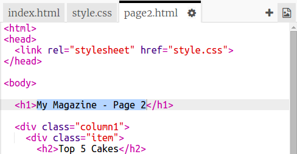
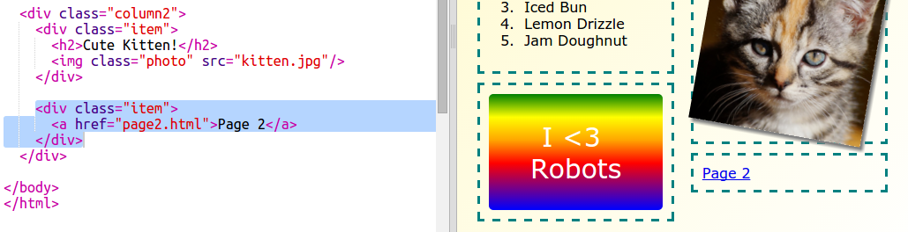

## दुसरे पेज जोडा

आपल्या मॅगझिन वेबसाइटवर आणखी एक पेज जोडा.

+ आपल्या प्रोजेक्टमध्ये एक नवीन पृष्ठ जोडा आणि त्यास `page2.html` नाव द्या:

+ पृष्ठ 2 आपल्या मासिकाच्या पहिल्या पृष्ठासारखेच असेल जेणेकरुन आपण `index.html` वरून Html कॉपी करू शकता आणि `page2.html` मध्ये पेस्ट करा.

लक्षात घ्या की दोन्ही पृष्ठे समान `style.css` वापरतात म्हणून ते स्टाइल सामायिक करतील.

+ पेज 2 साठी `<h1>` शीर्षक बदला:

+ आता आपल्याला आपल्या पेजमध्ये लिंक आवश्यक आहेत जेणेकरून आपण पेज 2 वर आणि पुढील पेजवर परत जाऊ शकता.

`index.html` वर परत जा, आणि `index.html` मध्ये स्तंभ 2 मधील एक डिव्हच्या आत एक दुवा जोडा:

+ आपण आपल्या नवीन लिंकवर क्लिक करू आणि आपल्या मॅगझिनच्या पेज 2 वर जाऊ शकता याची चाचणी घ्या.