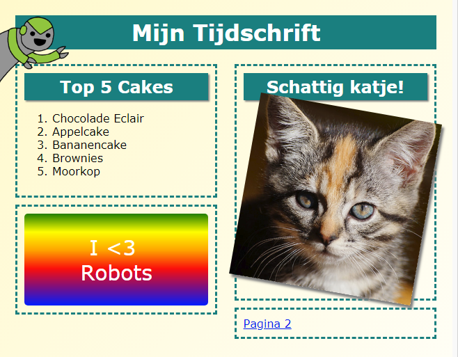

## Inleiding

In dit project leer je hoe je HTML en CSS kunt gebruiken om een tijdschrift website met meerdere pagina's te maken met een lay-out van twee pagina's. Je zult ook veel HTML- en CSS-technieken uit andere projecten opnieuw gebruiken.

  <iframe src="https://trinket.io/embed/html/af185af570?outputOnly=true&start=result" width="600" height="505" frameborder="0" marginwidth="0" marginheight="0" allowfullscreen>
  </iframe>
  

### Aanvullende informatie voor clubleiders

Als je dit project wilt afdrukken, gebruik dan de [ printvriendelijke versie ](https://projects.raspberrypi.org/nl-NL/projects/magazine/print).

--- collapse ---
---
title: Clubleider notities
---
## Inleiding:

In dit project leren kinderen een lay-out met twee kolommen te maken. Ze zullen ook veel van de HTML & CSS die ze hebben geleerd in andere projecten gebruiken.

## Online bronnen

We raden aan [trinket](https://trinket.io/) te gebruiken om online HTML & CSS te scrhijven. Dit project bevat de volgende trinkets:

* ['Tijdschrift' startpunt -- jumpto.cc/web-magazine](http://jumpto.cc/web-magazine)

Kinderen kunnen ook gebruik maken van deze lege trinket [(jumpto.cc/html-blank)](http://jumpto.cc/html-blank) om hun eigen HTML & CSS te schrijven, of ze kunnen deze trinket [(jumpto.cc/html-template)](http://jumpto.cc/html-template) gebruiken.

Er is ook een trinket met een voorbeeldoplossing voor de uitdagingen:

* ['Tijdschrift' voltooid -- trinket.io/html/af185af570](https://trinket.io/html/af185af570)

## Offline bronnen

Dit project kan indien gewenst [geheel offline](https://www.codeclubprojects.org/en-GB/resources/webdev-working-offline/) voltooid worden. Je krijgt toegang tot de projectbestanden door op de koppeling 'Projectmateriaal' voor dit project te klikken. Deze link bevat een 'Projectbronnen'-sectie die bronnen bevat om dit project offline te voltooien. Zorg ervoor dat elk kind toegang heeft tot een kopie van deze bestanden. Dit gedeelte bevat de volgende bestanden:

* intro/index.html
* template/template.html
* template/style.css
* magazine/index.html
* magazine/style.css
* magazine/script.js
* magazine/mutliple .png images

Je kunt ook een voltooide versie van de uitdagingen van dit project vinden in de sectie 'Vrijwilligersbestanden', die het volgende bevat:

* magazine-finished/index.html
* magazine-finished/style.css
* magazine-finished/script.js
* magazine-finished/kitten.jpg
* magazine-finished/recipe-finished.jpg
* magazine-finished/greenrobot.png
* magazine-finished/spacerobot.png

(Alle bovenstaande bestanden kunnen ook als `.zip` -bestanden worden gedownload.)

## Leerdoelen

* Dit project leert kinderen hoe ze een tweekoloms lay-out in tijdschriftstijl kunnen maken met `float:`. Het bevat ook veel van de HTML & CSS die meer in detail in andere projecten worden behandeld. Er worden voorbeelden gegeven zodat kinderen dit project kunnen voltooien, zelfs als ze sommige van de eerdere projecten niet hebben voltooid. 

Dit project behandelt elementen uit de volgende onderdelen van het [Raspberry Pi Digital Making Curriculum](https://rpf.io/curriculum):

* [Ontwerp standaard 2D- en 3D-objecten](https://www.raspberrypi.org/curriculum/design/creator).

## Uitdagingen

* "Onderdelen aan de linkerkolom toevoegen" - onderdelen in een zwevend element plaatsen;
* "Voeg een link toe naar de eerste pagina" - maak links tussen pagina's in een project;
* "Vul je tweede pagina in" - meer HTML & CSS herhalen;
* "Voeg nog een animatie toe" - herhaling van animaties maken.

--- /collapse ---

--- collapse ---
---
title: Projectmateriaal
---
## Projectbronnen

* [.zip-bestand met alle projectbestanden](resources/magazine-project-resources.zip)
* [Online Trinket met alle projectbestanden van het 'Tijdschrift'](http://jumpto.cc/web-magazine)
* [Online Trinket template](http://jumpto.cc/trinket-template)
* [Online lege Trinket](http://jumpto.cc/trinket-blank)
* [template/index.html](resources/template-index.html)
* [template/style.css](resources/template-style.css)
* [intro/index.html](resources/intro-index.html)
* [intro/style.css](resources/intro-style.css)
* [magazine/index.html](resources/magazine-index.html)
* [magazine/style.css](resources/magazine-style.css)
* [magazine/script.js](resources/magazine-script.js)
* [magazine/kitten.jpg](resources/magazine-kitten.jpg)
* [magazine/recipe-final.png](resources/magazine-recipe-final.png)
* [magazine/greenrobot.png](resources/magazine-greenrobot.png)
* [magazine/firerobot.png](resources/magazine-firerobot.png)
* [magazine/spacerobot.png](resources/magazine-spacerobot.png)
* [magazine/dogrobot.png](resources/magazine-dogrobot.png)

## Clubleider bronnen

* [.zip-bestand met alle voltooide projectbestanden](resources/magazine-volunteer-resources.zip)
* [ Voltooid online Trinket-project](https://trinket.io/html/af185af570)
* [magazine-finished/index.html](resources/magazine-finished-index.html)
* [magazine-finished/style.css](resources/magazine-finished-style.css)
* [magazine-finished/script.js](resources/magazine-finished-script.js)
* [magazine-finished/kitten.jpg](resources/magazine-finished-kitten.jpg)
* [magazine-finished/recipe-final.png](resources/magazine-finished-recipe-final.png)
* [magazine-finished/greenrobot.png](resources/magazine-finished-greenrobot.png)
* [magazine-finished/spacerobot.png](resources/magazine-finished-spacerobot.png)

--- /collapse ---