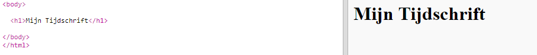
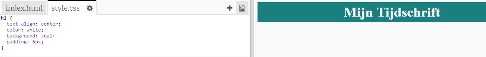
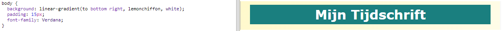

## Titel en achtergrond

Websites in tijdschriftenstijl hebben vaak veel kleine items op een pagina. Eerst ga je een titel en achtergrond voor je tijdschrift maken.

+ Open deze trinket: <a href="http://jumpto.cc/web-magazine" target="_blank">jumpto.cc/web-magazine</a>.
    
    Het project zou er als volgt uit moeten zien:
    
    

+ Laten we een titel toevoegen.
    
    Je kunt een betere titel bedenken voor je tijdschrift.
    
    

+ Kun je de titel stylen?
    
    Hier is een voorbeeld, maar je kunt je eigen stijl kiezen:
    
    

+ Laten we nu een interessante achtergrond maken met een verloop en een lettertype kiezen voor het tijdschrift.
    
    Hier is een voorbeeldstijl als herinnering over het maken van een verloop:
    
    