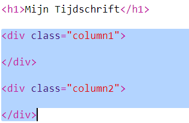
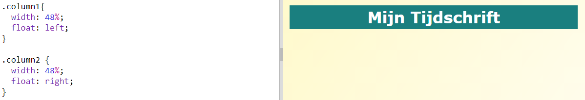
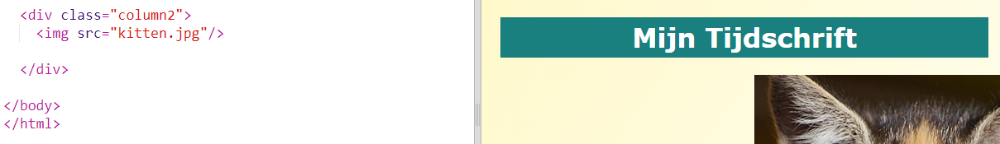
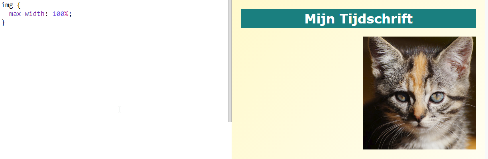

## Kolommen maken

Websites gebruiken vaak meerdere kolommen. Laten we een indeling met twee kolommen maken voor je tijdschrift.

+ Maak eerst twee kolom ` div's `.
    
    Voeg de gemarkeerde HTML toe aan ` index.html `:
    
    

+ Stijl nu de kolom div's zodat de ene zich aan aan de linkerkant bevindt en de andere aan de rechterkant.
    
    
    
    Elke kolom is minder dan 50% breedt, dus er is ruimte voor opvulling.
    
    Je moet iets aan een kolom toevoegen om het effect te zien.

+ Laten we een kattenfoto bovenaan kolom 2 toevoegen.
    
    
    
    Merk op dat de kattenafbeelding ongeveer halverwege de pagina staat, in de tweede kolom.
    
    Het is echter een beetje groot!

+ Laten we ` max-width: ` gebruiken om afbeeldingen in een container te laten passen.
    
    Voeg de volgende stijl toe aan ` style.css `.
    
    
    
    Dit is van toepassing op alle afbeeldingen die je in je tijdschrift gebruikt, niet alleen op de kat.

+ Voeg nu een klasse ` foto ` toe aan de afbeelding, zodat je deze kunt stijlen:
    
    

+ En stijl de afbeelding door een schaduw en een draai toe te voegen om de foto uit de pagina te laten komen:
    
    
    
    Breng enkele wijzigingen aan totdat je tevreden bent met het resultaat.