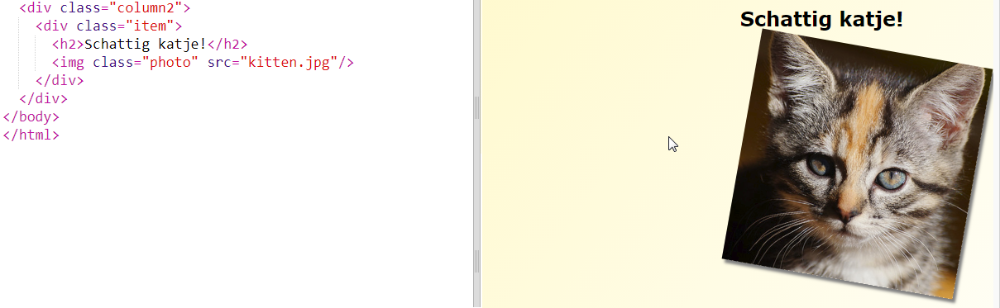
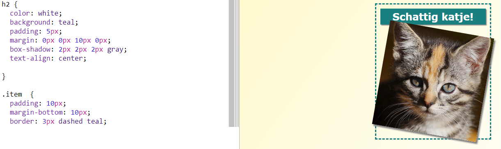

## Artikelen vormgeven

Laten we de lay-out een beetje interessanter maken.

+ Voeg een `div` toe rond je afbeelding met een `class` en voeg een `h2` -kop toe:
    
    

+ Stijl nu het item en de titel.
    
    Hier is een voorbeeld, maar je kunt zelf wijzigingen aanbrengen:
    
    