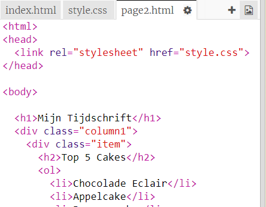

## Voeg een tweede pagina toe

Laten we nog een pagina toevoegen aan je tijdschrift website.

+ Voeg een nieuwe pagina aan je project toe en noem deze ` page2.html `:

+ Pagina 2 zal vrijwel gelijk zijn aan de eerste pagina van je tijdschrift, dus je kunt de html van ` index.html ` kopiëren en in ` page2.html ` plakken.

Merk op dat beide pagina's dezelfde ` style.css ` gebruiken, zodat ze stijlen kunnen delen.

+ Verander de `<h1>` titel voor pagina 2:

+ Nu heb je links (verbindingen) tussen je pagina's nodig om naar pagina 2 en weer terug naar de voorpagina te kunnen gaan.

Ga terug naar ` index.html `. Voeg een link in een div toe in kolom 2 van ` index.html `:

+ Test dat je op uw nieuwe link kunt klikken om naar pagina 2 van je tijdschrift kunt gaan.