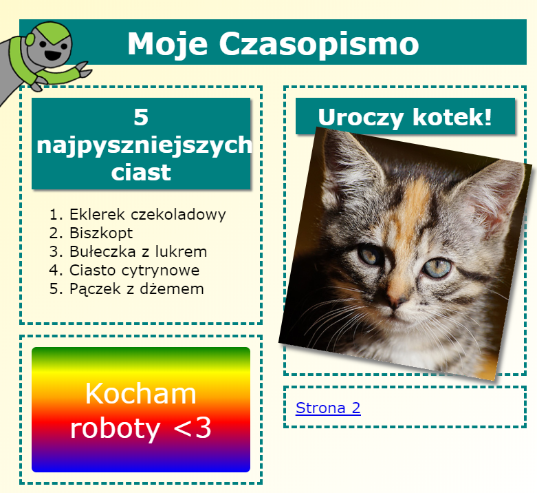

## Wprowadzenie

W tym projekcie nauczysz się, jak używać HTML i CSS, aby utworzyć wielostronicową witrynę w stylu czasopisma z układem dwóch stron. Będziesz korzystać z wielu technologii HTML i CSS już użytych przy innych projektach.

  <iframe src="https://trinket.io/embed/html/a41e4e1c5c?outputOnly=true&start=result" width="600" height="505" frameborder="0" marginwidth="0" marginheight="0" allowfullscreen>
  </iframe>
  

### Dodatkowe informacje dla liderów klubu

Jeśli chcesz wydrukować ten projekt, skorzystaj z [wersji do druku](https://projects.raspberrypi.org/en/projects/magazine/print).

## \--- collapse \---

## title: Notatki dla liderów klubu

## Wprowadzenie

W tym projekcie dzieci nauczą się tworzyć układ dwukolumnowy. Powtórzą także wiele właściwości CSS i HTML, których nauczyły się w innych projektach.

## Zasoby online

Do pisania kodu HTML i CSS online zalecamy używanie edytora [trinket](https://trinket.io/). Ten projekt zawiera następujące szablony:

* [Punkt początkowy "Czasopismo" - jumpto.cc/web-magazine](http://jumpto.cc/web-magazine)

Dzieci mogą również skorzystać z tego pustego szablonu [(jumpto.cc/html-blank)](http://jumpto.cc/html-blank), aby napisać własny kod HTML i CSS lub mogą użyć uzupełnionego szablonu [(jumpto.cc/html-template)](http://jumpto.cc/html-template).

Dostępny jest także projekt zawierający przykładowe rozwiązania wyzwań:

* [Ukończone "Czasopismo" - trinket.io/html/a41e4e1c5c](https://trinket.io/html/a41e4e1c5c)

## Zasoby offline

Ten projekt może być [ukończony w trybie offline](https://www.codeclubprojects.org/en-GB/resources/webdev-working-offline/). Materiały potrzebne do wykonania projektu dostępne są po kliknięciu linku "Materiały do projektu". Można znaleźć tam sekcję "Zasoby", która zawiera materiały potrzebne dzieciom do wykonania projektu w wersji offline. Upewnij się, że każde dziecko ma dostęp do własnej kopii zasobów. Ta sekcja zawiera następujące pliki:

* intro/index.html
* template/template.html
* template/style.css
* magazine/index.html
* magazine/style.css
* magazine/script.js
* magazine/mutliple.png obrazy

Ukończoną wersję wyzwań tego projektu możesz znaleźć w sekcji "Zasoby dla wolontariuszy", która zawiera:

* magazine-finished/index.html
* magazine-finished/style.css
* magazine-finished/script.js
* magazine-finished/kitten.jpg
* magazine-finished/recipe-finished.jpg
* magazine-finished/greenrobot.png
* magazine-finished/spacerobot.png

(Wszystkie powyższe zasoby można również pobrać jako pliki `.zip`.)

## Cele dydaktyczne

* Ten projekt uczy dzieci, jak utworzyć dwukolumnowy układ stylu czasopisma, używając `float:`. Pomaga również w przypomnieniu sporej ilości właściwości HTML i CSS, które są bardziej szczegółowo omówione w innych projektach. W projekcie podano przykłady, aby dzieci były w stanie wykonać wyzwania, nawet jeśli nie ukończyły wcześniejszych projektów. 

Projekt ten pokrywa elementy z następujących wątków [Cyfrowego programu nauczania Raspberry Pi](http://rpf.io/curriculum):

* [Projektowanie podstawowych zasobów 2D i 3D](https://www.raspberrypi.org/curriculum/design/creator).

## Wyzwania

* "Dodaj elementy do lewej kolumny" - umieszczanie przedmiotów w pływającym elemencie;
* "Dodaj link z powrotem do pierwszej strony" - tworzenie łączy między stronami w projekcie;
* "Wypełnij drugą stronę" - przypomnienie HTML oraz CSS;
* "Dodaj kolejną animację" - przypomnienie animacji.

\--- /collapse \---

## \--- collapse \---

## title: Materiały do projektu

## Zasoby projektu

* [Plik.zip zawierający wszystkie zasoby potrzebne do wykonania projektu](https://rpf.io/p/en/magazine-go)
* [Szablon zawierający wszystkie zasoby potrzebne do realizacji projektu "Czasopismo"](http://jumpto.cc/web-magazine)
* [Uzupełniony szablon](http://jumpto.cc/trinket-template)
* [Pusty szablon](http://jumpto.cc/trinket-blank)
* [template/index.html](resources/template-index.html)
* [template/style.css](resources/template-style.css)
* [intro/index.html](resources/intro-index.html)
* [intro/style.css](resources/intro-style.css)
* [magazine/index.html](resources/magazine-index.html)
* [magazine/style.css](resources/magazine-style.css)
* [magazine/script.js](resources/magazine-script.js)
* [magazine/kitten.jpg](resources/magazine-kitten.jpg)
* [magazine/recipe-final.png](resources/magazine-recipe-final.png)
* [magazine/greenrobot.png](resources/magazine-greenrobot.png)
* [magazine/firerobot.png](resources/magazine-firerobot.png)
* [magazine/spacerobot.png](resources/magazine-spacerobot.png)
* [magazine/dogrobot.png](resources/magazine-dogrobot.png)

## Zasoby dla lidera klubu

* [Plik .zip zawierający zasoby z ukończonym projektem](https://rpf.io/p/en/magazine-go)
* [Szablon zawierający ukończony projekt](https://trinket.io/html/a41e4e1c5c)
* [magazine-finished/index.html](resources/magazine-finished-index.html)
* [magazine-finished/style.css](resources/magazine-finished-style.css)
* [magazine-finished/script.js](resources/magazine-finished-script.js)
* [magazine-finished/kitten.jpg](resources/magazine-finished-kitten.jpg)
* [magazine-finished/recipe-final.png](resources/magazine-finished-recipe-final.png)
* [magazine-finished/greenrobot.png](resources/magazine-finished-greenrobot.png)
* [magazine-finished/spacerobot.png](resources/magazine-finished-spacerobot.png)

\--- /collapse \---