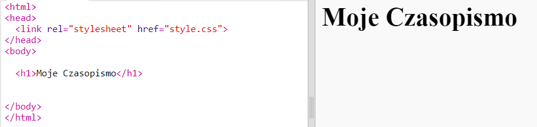

## Nagłówek i tło

Witryny stylizowane na magazyny często zawierają wiele małych elementów na stronie. Najpierw utworzysz nagłówek i tło dla twojego czasopisma.

+ Otwórz edytor: <a href="http://jumpto.cc/web-magazine" target="_blank">jumpto.cc/web-magazine</a>.
    
    Twój projekt powinien wyglądać następująco:
    
    

+ Dodajmy nagłówek.
    
    Możesz wymyślić lepszy tytuł dla twojego czasopisma.
    
    

+ Czy umiesz nadać styl nagłówkowi?
    
    Oto przykład, ale możesz wybrać własny styl:
    
    

+ Teraz stwórzmy ciekawe tło za pomocą gradientu i wybierzmy font do czasopisma.
    
    Oto przykładowy styl przypominający, jak tworzy się gradient:
    
    