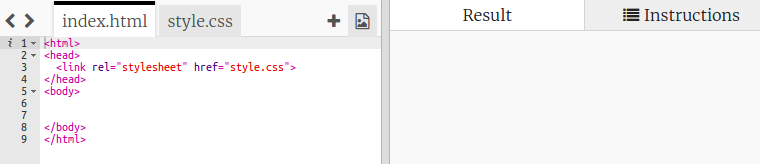
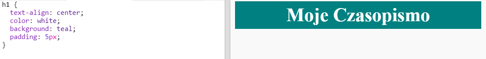

## Nagłówek i tło

Witryny w stylu magazynów często zawierają wiele małych elementów na stronie. Najpierw utworzymy nagłówek i tło dla twojego czasopisma.

+ Otwórz tę bibelotkę: <a href="http://jumpto.cc/web-magazine" target="_blank">jumpto.cc/web-magazine</a>.
    
    Projekt powinien wyglądać tak:
    
    

+ Dodajmy nagłówek.
    
    Możesz wymyślić lepszy tytuł do swojego magazynu.
    
    

+ Czy umiesz nadać tytuł nagłówkowi?
    
    Oto przykład, ale możesz wybrać własny styl:
    
    

+ Teraz stwórzmy ciekawe tło za pomocą gradientu i wybierzmy czcionkę do magazynu.
    
    Oto przykładowy styl przypominający o tworzeniu gradientu:
    
    