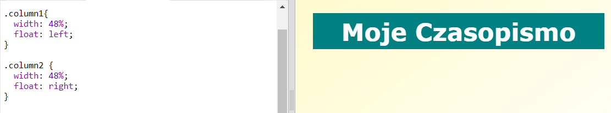

## Tworzenie kolumn

Witryny często używają wielu kolumn. Stwórzmy układ dwóch kolumn dla twojego czasopisma.

+ Najpierw utwórz dwa tagi `div` dla kolumn.
    
    Dodaj podświetlony kod HTML do `index.html`:
    
    

+ Teraz nadaj styl w tagach div dla kolumn, aby jedna przesunęła się na lewo, a druga na prawo.
    
    
    
    Każda kolumna jest mniejsza niż 50%, więc jest miejsce na wypełnienie.
    
    Aby zobaczyć efekt, musisz dodać coś do kolumny.

+ Dodajmy obrazek kotka na górze kolumny 2.
    
    
    
    Zwróć uwagę, że obrazek kotka jest umieszczony w połowie długości strony w drugiej kolumnie.
    
    Jest jednak trochę za duży!

+ Użyjmy `max-width:`, aby dopasować obrazy do ich kontenera.
    
    Dodaj następujący styl do `style.css`.
    
    
    
    Będzie miał wpływ na wszystkie obrazy, których używasz w swoim czasopiśmie, nie tylko kotka.

+ Teraz dodaj klasę `photo` do obrazka, aby móc go stylizować:
    
    

+ Wystylizuj obraz, dodając cień i obrót, aby zdjęcie wyróżniało się na tle strony:
    
    
    
    Wprowadzaj zmiany, dopóki nie będziesz zadowolony z wyniku.