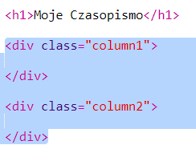
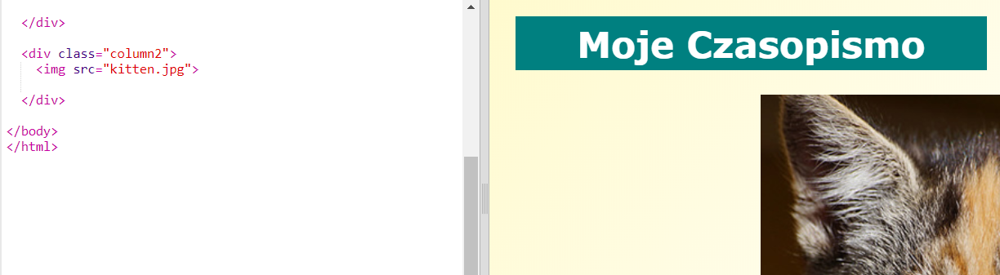

## Tworzenie kolumn

Witryny często używają wielu kolumn. Stwórzmy układ dwóch kolumn dla Twojego czasopisma.

+ Najpierw utwórz dwie kolumny `div`s.
    
    Dodaj podświetlony kod HTML do `index.html`:
    
    

+ Teraz ustaw kolumny div tak, aby jedna przesunęła się na lewo, a druga na prawo.
    
    
    
    Każda kolumna jest mniejsza niż 50%, więc jest miejsce na wypełnienie.
    
    Aby zobaczyć efekt, musisz dodać coś do kolumny.

+ Dodajmy obrazek kotka na szczyt kolumny 2.
    
    
    
    Zwróć uwagę, że obraz kociaka jest umieszczony w połowie długości strony w drugiej kolumnie.
    
    Jest jednak trochę duże!

+ Użyjmy `max-width:`, aby dopasować obrazy do ich ramki.
    
    Dodaj następujący styl do `style.css`.
    
    
    
    Będzie on dotyczył wszystkich zdjęć, których używasz w swoim czasopiśmie, a nie tylko kociaka.

+ Teraz dodaj klasę `photo` do obrazka, aby móc je stylizować:
    
    

+ Wystylizuj obraz, aby dodać cień i twist, aby zdjęcie wyróżniało się na tle strony:
    
    
    
    Wprowadzaj zmiany, dopóki nie polubisz wyniku.