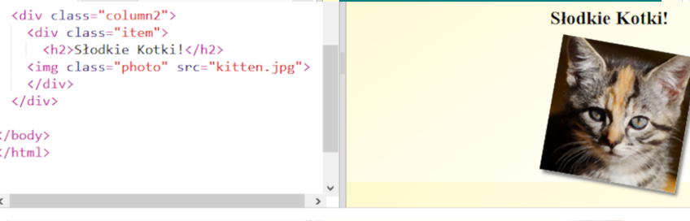
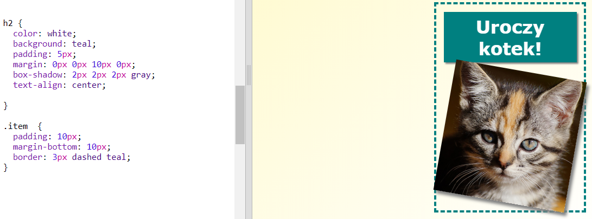

## Style przedmiotów magazynowych

Sprawmy, aby układ był nieco bardziej interesujący.

+ Dodaj `div` wokół swojego zdjęcia, używając `klasy` i dodaj nagłówek `h2`:
    
    

+ Teraz ułóż przedmiot i nagłówek.
    
    Oto przykład, ale możesz wprowadzić zmiany:
    
    