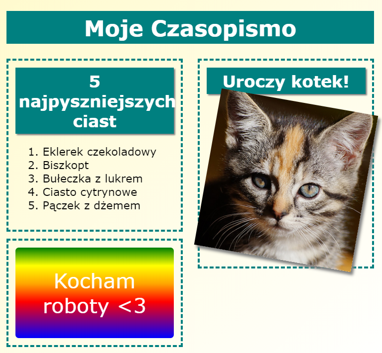

\--- challenge \---

## Wyzwanie: Dodaj elementy do lewej kolumny

Czy możesz dodać uporządkowaną listę i gradientową naklejkę z tekstem do lewej kolumny?

Oto przykład:

To jest kod przykładu, ale możesz go zmienić lub wymyślić własny.

HTML:

CSS:

\--- /challenge \---