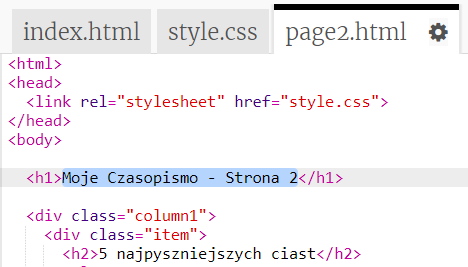

## Dodaj drugą stronę

Dodajmy kolejną stronę do twojego czasopisma.

+ Dodaj nową stronę do swojego projektu i nazwij ją `page2.html`:

+ Strona 2 będzie bardzo podobna do pierwszej strony Twojego czasopisma, więc możesz skopiować kod HTML z `index.html` i wkleić go do `strony2.html`.

Zwróć uwagę, że obie strony używają tego samego `style.css`, więc będą dzielić ze sobą style.

+ Zmień tytuł `<h1>` dla strony2:

+ Teraz będziesz potrzebować linków między stronami, aby przejść do strony 2 i wrócić na pierwszą stronę.

Wróć do `index.html`. Dodaj link wewnątrz elementu div w kolumnie 2 w `index.html`:

+ Sprawdź, czy możesz kliknąć na nowy link i przejść do strony 2 magazynu.