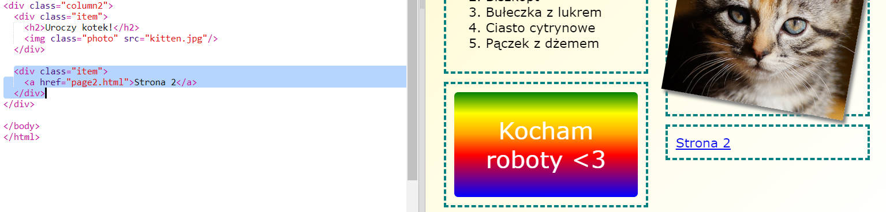

## Dodaj drugą stronę

Dodajmy kolejną stronę do twojego czasopisma.

+ Dodaj nową stronę do swojego projektu i nazwij ją `page2.html`:

+ Strona 2 będzie bardzo podobna do pierwszej strony twojego czasopisma, więc możesz skopiować kod Html z `index.html` i wkleić go do `page2.html`.

Zwróć uwagę, że obie strony używają tego samego `style.css`, więc będą dzielić ze sobą style.

+ Zmień tytuł `<h1>` dla strony2:

+ Teraz musisz dodać odnośniki pomiędzy twoimi stronami, aby można było się się dostać do drugiej strony, oraz z powrotem na stronę główną.

Wróć do `index.html`. Dodaj link wewnątrz elementu div w kolumnie 2 w `index.html`:

+ Sprawdź, czy możesz kliknąć na nowy link i przejść do drugiej strony magazynu.