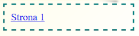

\--- challenge \---

## Wyzwanie: Dodaj link powracający do pierwszej strony

Czy możesz dodać link do `page2.html`, tak abyś mógł go kliknąć, aby powrócić na pierwszą stronę?

Podpowiedź: spójrz na kod HTML użyty do utworzenia linku do strony 2.

\--- /challenge \---