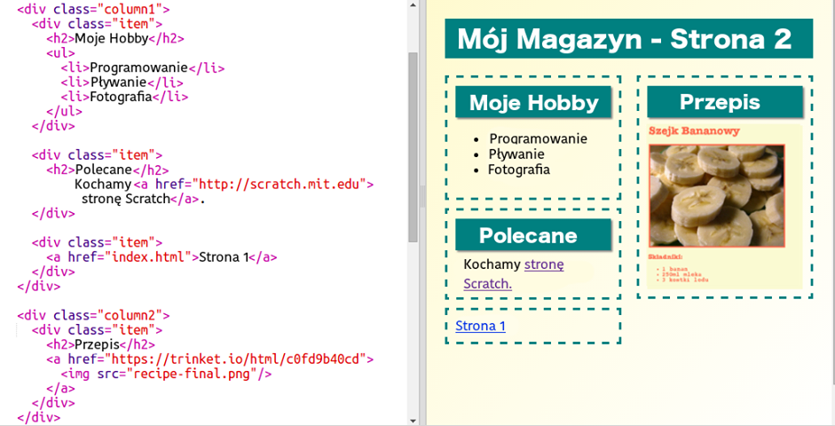

\--- wyzwanie \---

## Wyzwanie: Wypełnij drugą stronę

Oto kod wykorzystany w przykładzie, możesz jednak dowolnie zmienić `div` lub wymyślić własne rozwiązania.

Kliknij ikonę obrazów, aby wyświetlić obrazy, które możesz użyć:

Pamiętaj, że możesz przesłać własne obrazy do wykorzystania. Upewnij się jednak, że masz pozwolenie na użycie przesłanych zdjęć.

\--- /challenge \---