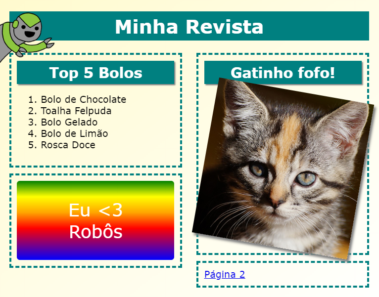

## Introdução

Neste projeto, você vai aprender como usar HTML e CSS para criar um website em formato de revista, com um layout de duas páginas. Você também vai rever muitas técnicas de HTML e CSS de outros projetos.

  <iframe src="https://trinket.io/embed/html/64f7ebe88e?outputOnly=true&start=result" width="600" height="505" frameborder="0" marginwidth="0" marginheight="0" allowfullscreen>
  </iframe>
  

### Informação adicional para líderes de clubes

Se você precisar imprimir este projeto, use a [Versão para Impressão](https://projects.raspberrypi.org/pt-BR/projects/magazine/print).

--- collapse ---
---
title: Notas do líder do clube
---

## Introdução

Neste projeto, as crianças vão aprender como criar um layout de duas colunas. Elas também vão revisar muitas coisas de HTML & CSS que elas aprenderam em outros projetos.

## Recursos Online

Recomendamos usar o [trinket](https://trinket.io/) para escrever HTML & CSS online. Este projeto contém os seguintes trinkets:

* [Ponto de partida da 'Revista' - jumpto.cc/web-magazine](http://jumpto.cc/web-magazine)

As crianças também podem fazer uso deste editor html em branco [(jumpto.cc/html-blank)](http://jumpto.cc/html-blank) para escrever seu próprio HTML & CSS, ou como alternativa, eles podem usar este template [(jumpto.cc/html-template)](http://jumpto.cc/html-template).

Há também um projeto trinket contendo um exemplo de solução para os desafios:

* ['Revista' Finalizada -- trinket.io/html/64f7ebe88e](https://trinket.io/html/64f7ebe88e)

## Recursos Offline

Este projeto pode ser [concluído offline](https://www.codeclubprojects.org/en-GB/resources/webdev-working-offline/), se você preferir. Você pode acessar os recursos do projeto clicando no link 'Materiais do Projeto' para este projeto. Este link contém uma seção 'Recursos do Projeto', que inclui recursos que as crianças precisarão para concluir esse projeto offline. Certifique-se de que cada criança tenha acesso a uma cópia desses recursos. Esta seção inclui os seguintes arquivos:

* intro/index.html
* template/template.html
* template/style.css
* magazine/index.html
* magazine/style.css
* magazine/script.js
* magazine/mutliple .png images

Você também pode encontrar uma versão completa dos desafios deste projeto na seção "Recursos para Voluntários", que contém:

* magazine-finished/index.html
* magazine-finished/style.css
* magazine-finished/script.js
* magazine-finished/kitten.jpg
* magazine-finished/recipe-finished.jpg
* magazine-finished/greenrobot.png
* magazine-finished/spacerobot.png

(Todos os recursos acima também podem ser baixados como arquivos `.zip` do projeto e dos voluntários.)

## Objetivos de aprendizado

* Este projeto ensina as crianças a criar um layout de revista de duas colunas usando `float:`. Ele também recapitula muito o HTML & CSS que são abordados com mais detalhes em outros projetos. São fornecidos exemplos para que as crianças possam concluir este projeto, mesmo que não tenham concluído alguns dos projetos anteriores. 

Este projeto abrange elementos das seguintes vertentes do [Currículo de Criação Digital Raspberry Pi](https://rpf.io/curriculum):

* [Design de ilustrações 2D e 3D básicas](https://www.raspberrypi.org/curriculum/design/creator).

## Desafios

* "Adicionar itens à coluna esquerda" - inserindo itens dentro de um elemento flutuante;
* "Adicionar um link de volta para a primeira página" - criando links entre páginas em um projeto;
* "Preencher sua segunda página" - recapitulando mais HTML & CSS;
* "Adicionar outra animação" - recapitulando animações.

--- /collapse ---

--- collapse ---
---
title: Materiais do projeto
---

## Recursos do projeto

* [Arquivo.zip contendo todos os recursos do projeto](https://rpf.io/p/pt-BR/magazine-go)
* [Projeto Online Trinket contendo todos os recursos do projeto 'Revista'](http://jumpto.cc/web-magazine)
* [Template Online Trinket](http://jumpto.cc/trinket-template)
* [Trinket Online em branco](http://jumpto.cc/trinket-blank)
* [template/index.html](resources/template-index.html)
* [template/style.css](resources/template-style.css)
* [intro/index.html](resources/intro-index.html)
* [intro/style.css](resources/intro-style.css)
* [magazine/index.html](resources/magazine-index.html)
* [magazine/style.css](resources/magazine-style.css)
* [magazine/script.js](resources/magazine-script.js)
* [magazine/kitten.jpg](resources/magazine-kitten.jpg)
* [magazine/recipe-final.png](resources/magazine-recipe-final.png)
* [magazine/greenrobot.png](resources/magazine-greenrobot.png)
* [magazine/firerobot.png](resources/magazine-firerobot.png)
* [magazine/spacerobot.png](resources/magazine-spacerobot.png)
* [magazine/dogrobot.png](resources/magazine-dogrobot.png)

## Recursos do líder do clube

* [Arquivo .zip contendo todos os recursos do projeto](https://rpf.io/p/pt-BR/magazine-go)
* [Trinket Online completo](https://trinket.io/html/64f7ebe88e)
* [magazine-finished/index.html](resources/magazine-finished-index.html)
* [magazine-finished/style.css](resources/magazine-finished-style.css)
* [magazine-finished/script.js](resources/magazine-finished-script.js)
* [magazine-finished/kitten.jpg](resources/magazine-finished-kitten.jpg)
* [magazine-finished/recipe-final.png](resources/magazine-finished-recipe-final.png)
* [magazine-finished/greenrobot.png](resources/magazine-finished-greenrobot.png)
* [magazine-finished/spacerobot.png](resources/magazine-finished-spacerobot.png)

--- /collapse ---