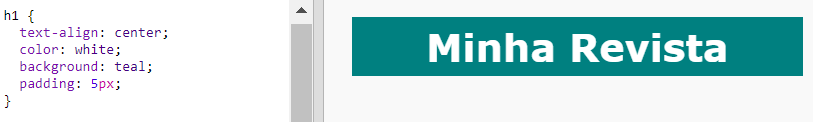

## Cabeçalho e pano de fundo

Os sites no estilo de revistas geralmente têm muitos itens pequenos em uma página. Primeiro, você criará um cabeçalho e um pano de fundo para sua revista.

+ Abra este trinket: <a href="http://jumpto.cc/web-magazine" target="_blank">jumpto.cc/web-magazine</a>.
    
    O projeto deve ficar assim:
    
    

+ Vamos adicionar um cabeçalho.
    
    Você pode pensar em um título melhor para sua revista.
    
    

+ Você consegue dar estilo ao cabeçalho?
    
    Aqui tem um exemplo, mas você pode escolher seu próprio estilo:
    
    

+ Agora vamos criar um plano de fundo interessante usando um gradiente e escolha uma fonte para a revista.
    
    Aqui estão alguns exemplos de estilo para lembrar de como criar um gradiente:
    
    