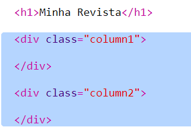
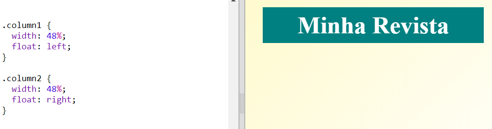

## Criando colunas

Os sites costumam usar várias colunas. Vamos criar um layout de duas colunas para sua revista.

+ Primeiro crie uma `div` de duas colunas.
    
    Adicione o HTML em destaque ao `index.html`:
    
    

+ Agora, estilize as colunas da div para que uma flutue para a esquerda e a outra flutue para a direita.
    
    
    
    Cada coluna tem menos de 50%, portanto, há espaço para preenchimento.
    
    Você precisará adicionar algo a uma coluna para ver o efeito.

+ Vamos adicionar uma imagem de gatinho no topo da coluna 2.
    
    
    
    Observe que a imagem do gatinho está posicionada na metade da página, na segunda coluna.
    
    Está um pouco grande!

+ Vamos usar `max-width:` para as imagens se ajustarem ao contêiner.
    
    Adicione o seguinte estilo ao `style.css`.
    
    
    
    Isso se aplicará a todas as imagens que você usa na sua revista, não apenas ao gatinho.

+ Agora adicione uma classe `photo` à imagem para poder estilizá-la:
    
    

+ E estilize a imagem para adicionar uma sombra e um toque para fazer a foto sair da página:
    
    
    
    Faça algumas alterações até gostar do resultado.