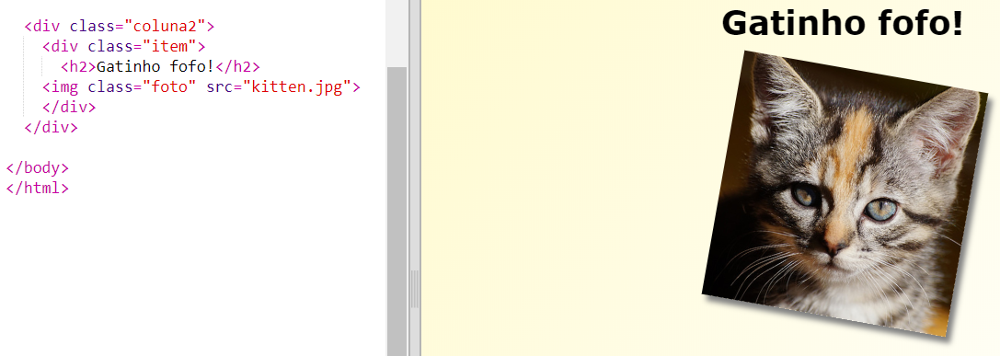
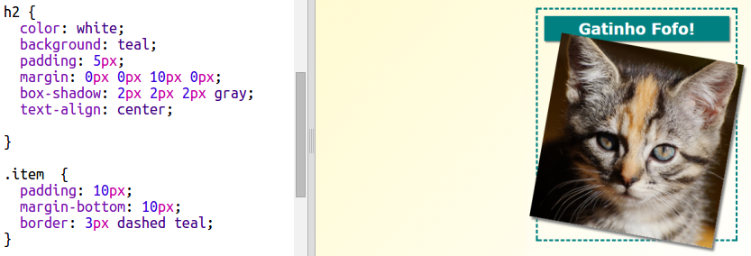

## Itens de estilo da revista

Vamos fazer o layout ser um pouco mais interessante.

+ Adicione uma `div` em volta da sua imagem com uma `class` e adiciona um cabeçalho `h2`:
    
    

+ Agora adicione estilo ao item e ao cabeçalho.
    
    Aqui está um exemplo, mas você pode fazer mudanças:
    
    