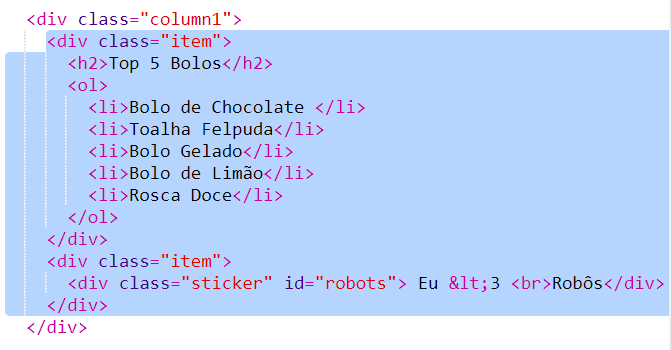

\--- challenge \---

## Desafio: Adicionar itens na coluna à esquerda

Você consegue adicionar uma lista ordenada e um adesivo de texto gradiente à coluna da esquerda?

Aqui está um lindo exemplo:

Aqui está o código para exemplo, mas você pode alterar as divs ou trazer suas próprias ideias.

HTML:

CSS:

\--- /challenge \---