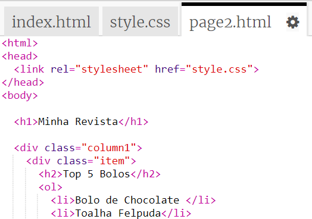
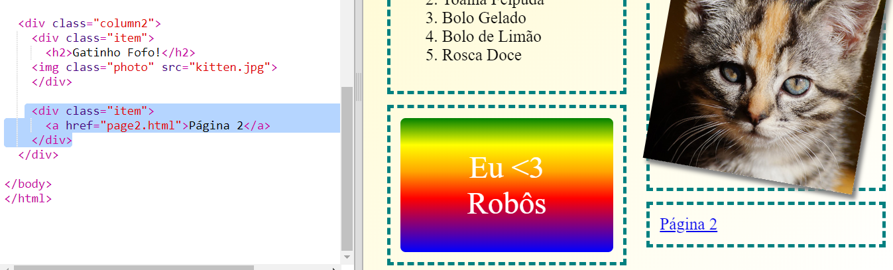

## Adicionando a segunda página

Vamos adicionar outra página ao site da sua revista.

+ Adicione uma nova página ao seu projeto e nomeie-a como `pagina2.html`:

+ A página 2 será bem parecida com a primeira página da sua revista, para que você possa copiar o html de `index.html` e colá-lo em `pagina2.html`.

Observe que as duas páginas usam o mesmo `style.css` para compartilhar os estilos.

+ Altere o título `<h1>` da pagina2:

+ Agora você precisará de links entre suas páginas para acessar a página 2 e voltar à página inicial.

Volte para `index.html`. Adicione um link dentro de uma div na coluna 2 em `index.html`:

+ Teste se você pode clicar no seu novo link e ir para a página 2 da sua revista.