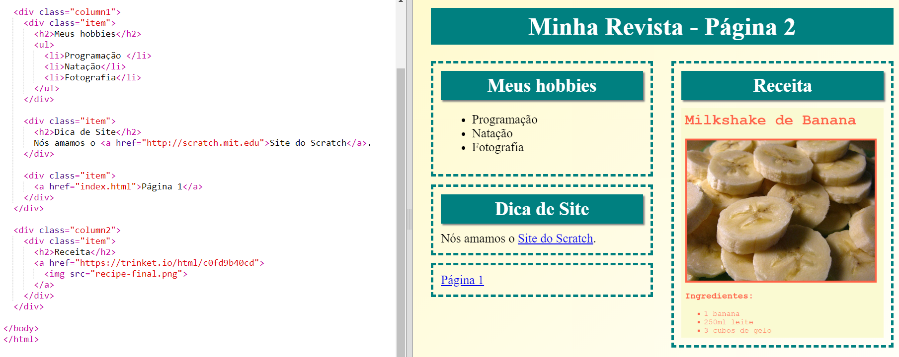
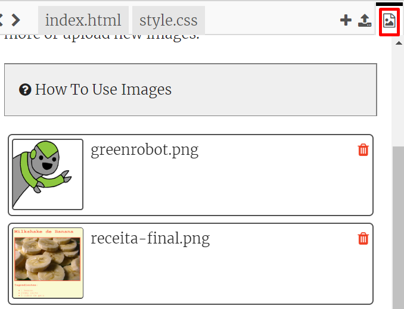

\--- challenge \---

## Desafio: Preencha sua segunda página

Aqui está o código para exemplos, mas você pode alterar as `div`s ou trazer suas próprias ideias.

Clique nos ícones das imagens para ver as imagens que estão disponíveis para usar:

Lembre-se de que você pode fazer upload das suas próprias imagens para usar. Tenha certeza de que você tem permissão para usar as imagens que você fez upload.

\--- /challenge \---