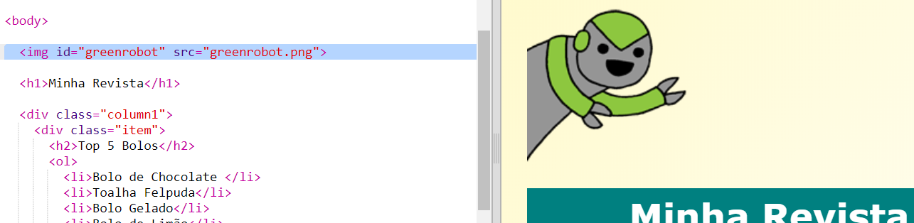

## Adicionar uma animação

Vamos adicionar uma animação divertida na sua revista.

+ Vá para `index.html` e inclua a imagem `greenrobot.png` no topo da sua página.

+ Agora adicione o CSS para animar seu robô:

