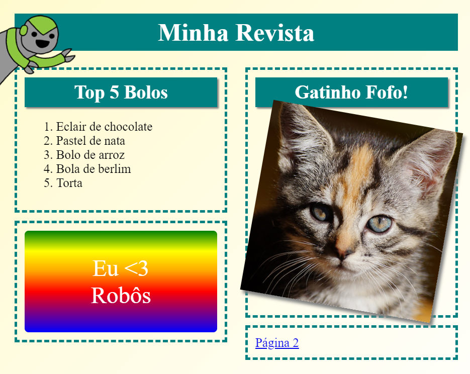

## Introdução

Neste projeto, vais aprender a usar HTML e CSS para criar um site de revista multi-página com um layout de duas páginas. Também vais revisitar muitas técnicas de HTML e CSS de outros projetos.

  <iframe src="https://trinket.io/embed/html/043a8ac9a5?outputOnly=true&start=result" width="600" height="505" frameborder="0" marginwidth="0" marginheight="0" allowfullscreen>
  </iframe>
  

### Informações adicionais para os líderes do clube

Se precisar imprimir este projeto, por favor, use a [versão para impressão](https://projects.raspberrypi.org/pt-PT/projects/magazine/print).

--- collapse ---
---
title: Notas para os líderes de clube
---

## Introdução

Neste projeto, as crianças vão aprender a criar um layout de duas colunas e recapitular muito do HTML & CSS que aprenderam noutros projetos.

## Recursos online

Recomendamos usar o [trinket](https://trinket.io/) para escrever HTML & CSS online. Este projeto contém os seguintes trinkets:

* [Ponto de partida da 'Revista' - jumpto.cc/web-magazine](http://jumpto.cc/web-magazine)

Os participantes podem utilizar este trinket em branco [(jumpto.cc/html-blank)](http://jumpto.cc/html-blank) para escrever o seu próprio HTML & CSS, ou então usar este modelo de trinket [(jumpto.cc/html-template)](http://jumpto.cc/html-template).

Há também um trinket que contém um exemplo de solução para os desafios:

* ['Revista' concluída - trinket.io/html/043a8ac9a5](https://trinket.io/html/043a8ac9a5)

## Recursos offline

Este projeto pode ser [concluído offline](https://www.codeclubprojects.org/en-GB/resources/webdev-working-offline/), se preferires. Podes aceder aos recursos do projeto clicando no link 'Materiais de Projeto' deste projeto. Este link contém uma secção 'Recursos do projeto', que inclui os recursos necessários à conclusão deste projeto em modo offline. Certifique-se de que cada participante tem acesso a uma cópia destes recursos. Esta secção inclui os seguintes arquivos:

* intro/index.html
* template/template.html
* template/style.css
* magazine/index.html
* magazine/style.css
* magazine/script.js
* magazine/mutliple .png images

Também pode encontrar uma versão completa dos desafios deste projeto na secção 'Recursos para Voluntários', que contém:

* magazine-finished/index.html
* magazine-finished/style.css
* magazine-finished/script.js
* magazine-finished/kitten.jpg
* magazine-finished/recipe-finished.jpg
* magazine-finished/greenrobot.png
* magazine-finished/spacerobot.png

(Todos os recursos acima também são transferíveis como arquivos `.zip` do projeto e voluntários.)

## Objetivos de Aprendizagem

* Este projeto ensina as crianças a criar um layout de revista de duas colunas usando `float:`. Ele também recapitula muito do CSS e do HTML & coberto em mais detalhes nutros projetos. São dados exemplos para que as crianças possam concluir este projeto, mesmo que não tenham concluído alguns dos projetos anteriores. 

Este projeto abrange elementos das seguintes vertentes do [Curriculo Raspberry Pi Digital Making](https://rpf.io/curriculum):

* [Criar conteúdos básicos em 2D e 3D](https://www.raspberrypi.org/curriculum/design/creator).

## Desafios

* "Adicionar itens à coluna esquerda" - colocando itens dentro de um elemento flutuante;
* "Adicionar um link de volta à primeira página" - criando links entre páginas num projeto;
* "Preencher a tua segunda página" - recapitulando mais HTML & CSS;
* "Adicionar outra animação" - recapitulando animações.

--- /collapse ---

--- collapse ---
---
title: Materiais do projeto
---

## Recursos do projeto

* [arquivo.zip contendo todos os recursos do projeto](https://rpf.io/p/pt-PT/magazine-go)
* [Trinket Online contendo todos os recursos do projeto 'Revista'](http://jumpto.cc/web-magazine)
* [Trinket modelo on-line](http://jumpto.cc/trinket-template)
* [Trinket em branco on-line](http://jumpto.cc/trinket-blank)
* [template/index.html](resources/template-index.html)
* [template/style.css](resources/template-style.css)
* [intro/index.html](resources/intro-index.html)
* [intro/style.css](resources/intro-style.css)
* [magazine/index.html](resources/magazine-index.html)
* [magazine/style.css](resources/magazine-style.css)
* [magazine/script.js](resources/magazine-script.js)
* [magazine/kitten.jpg](resources/magazine-kitten.jpg)
* [magazine/recipe-final.png](resources/magazine-recipe-final.png)
* [magazine/greenrobot.png](resources/magazine-greenrobot.png)
* [magazine/firerobot.png](resources/magazine-firerobot.png)
* [magazine/spacerobot.png](resources/magazine-spacerobot.png)
* [magazine/dogrobot.png](resources/magazine-dogrobot.png)

## Recursos do líder de clube

* [Arquivo.zip contendo todos os recursos do projeto concluídos](https://rpf.io/p/pt-PT/magazine-go)
* [Projeto Trinket concluido on-line](https://trinket.io/html/043a8ac9a5)
* [magazine-finished/index.html](resources/magazine-finished-index.html)
* [magazine-finished/style.css](resources/magazine-finished-style.css)
* [magazine-finished/script.js](resources/magazine-finished-script.js)
* [magazine-finished/kitten.jpg](resources/magazine-finished-kitten.jpg)
* [magazine-finished/recipe-final.png](resources/magazine-finished-recipe-final.png)
* [magazine-finished/greenrobot.png](resources/magazine-finished-greenrobot.png)
* [magazine-finished/spacerobot.png](resources/magazine-finished-spacerobot.png)

--- /collapse ---