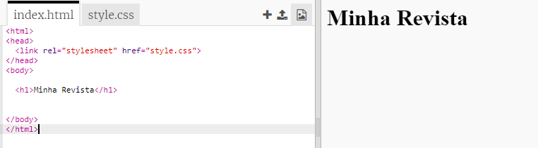
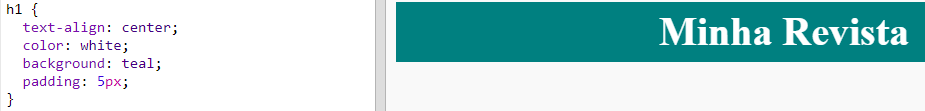
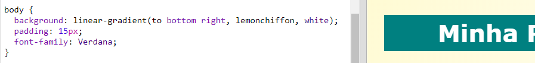

## Cabeçalho e Fundo

Os sites no estilo de revistas geralmente têm muitos itens pequenos numa página. Primeiro, vais criar um cabeçalho e um plano de fundo para sua revista.

+ Abre este trinket: <a href="http://jumpto.cc/web-magazine" target="_blank">jumpto.cc/web-magazine</a>.
    
    O projeto deverá parecer-se com isto:
    
    

+ Vamos adicionar um cabeçalho.
    
    Consegues pensar num título melhor para a tua revista.
    
    

+ Consegues dar estilo ao cabeçalho?
    
    Aqui está um exemplo, mas podes escolher o teu próprio estilo:
    
    

+ Agora vamos criar um plano de fundo interessante usando um gradiente e escolher uma fonte para a revista.
    
    Aqui está um exemplo de estilo para lembrar de como criar um gradiente:
    
    