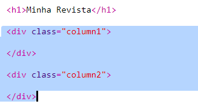
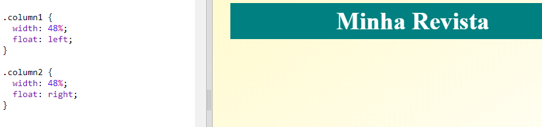
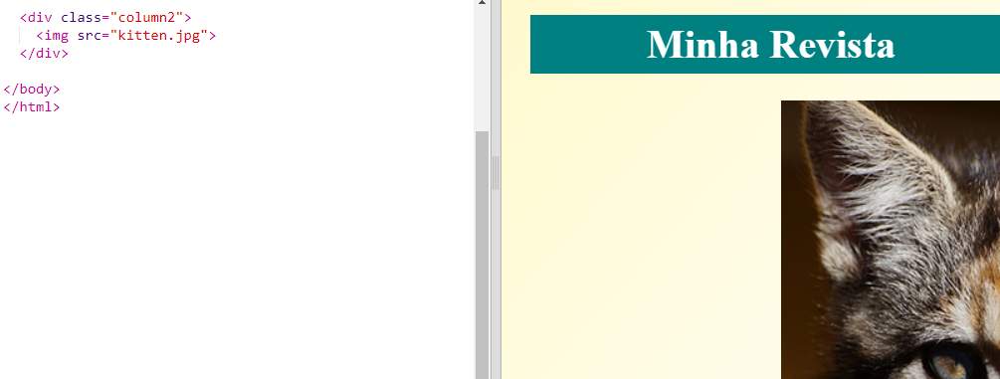
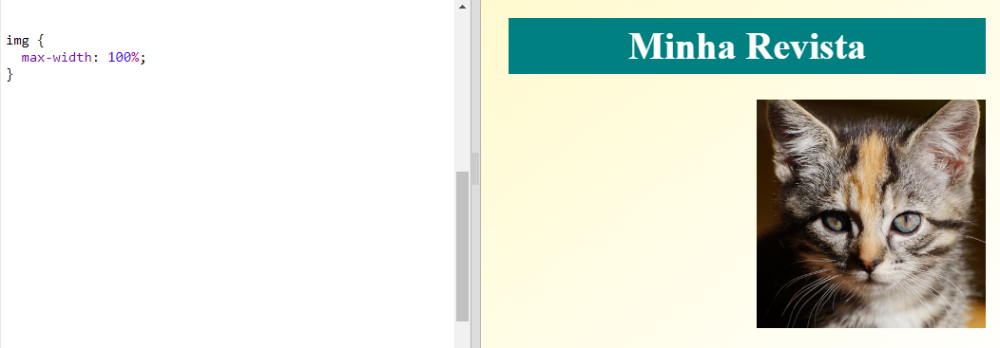

## Criar Colunas

Os sites costumam usar várias colunas. Vamos criar um layout de duas colunas para a tua revista.

+ Primeiro cria duas colunas `div`s.
    
    Adicione o HTML destacado ao `index.html`:
    
    

+ Agora, dá um estilo às colunas das divs para que uma flutue para a esquerda e a outra flutue para a direita.
    
    
    
    Cada coluna tem menos de 50%, portanto, há espaço para preenchimento.
    
    Vais ter que adicionar alguma coisa a uma coluna para ver o efeito.

+ Vamos adicionar uma imagem de um gatinho no topo da coluna 2.
    
    
    
    Nota que a imagem do gatinho está posicionada a meio da página, na segunda coluna.
    
    Está um bocadinho grande!

+ Vamos usar `max-width:` para fazer com que as imagens se encaixem dentro do contentor.
    
    Adiciona o seguinte estilo ao `style.css`.
    
    
    
    Isto vai aplicar-se a todas as imagens que usares na tua revista e não apenas ao gatinho.

+ Agora adiciona uma classe `foto` à imagem para poder dar-lhe um estilo:
    
    

+ E dá um estilo à imagem para adicionar uma sombra e uma orção para fazer a foto saltar da página:
    
    
    
    Faz alterações até estares satisfeito(a) com o resultado.