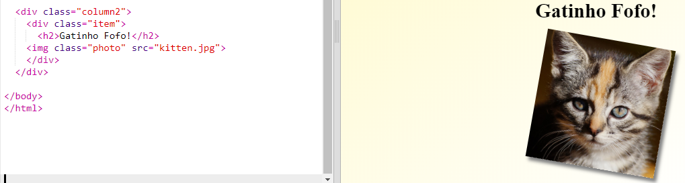
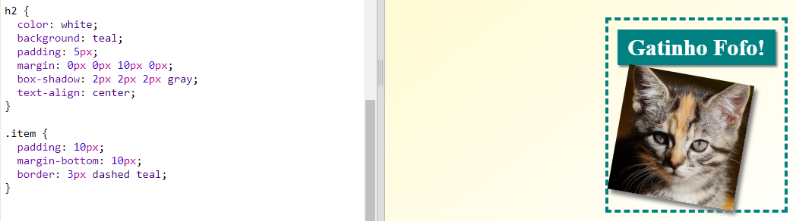

## Itens de Estilo da Revista

Vamos tornar o layout um pouco mais interessante.

+ Adicione uma `div` à volta da tua imagem com uma `classe` e adiciona um `h2` cabeçalho:
    
    

+ Agora dá estilo ao item e o cabeçalho.
    
    Aqui está um exemplo, mas podes fazer alterações:
    
    