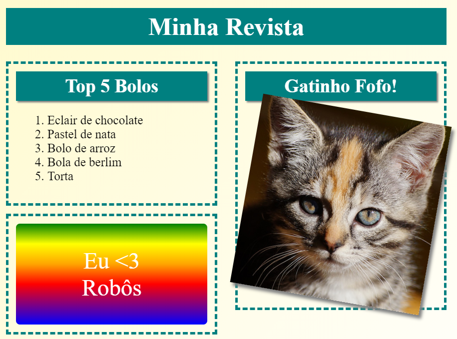
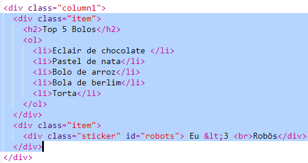

--- challenge ---

## Desafio: Adicionar itens à coluna esquerda

Podes adicionar uma lista ordenada e uma imagem de texto em gradiente à coluna da esquerda?

Aqui tens um exemplo:

Este é o código para o exemplo, mas podes alterá-lo ou criar o teu próprio.

HTML:

CSS:

--- /challenge ---