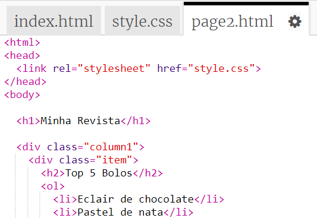
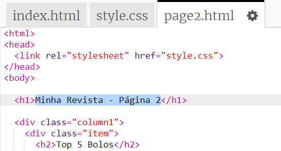
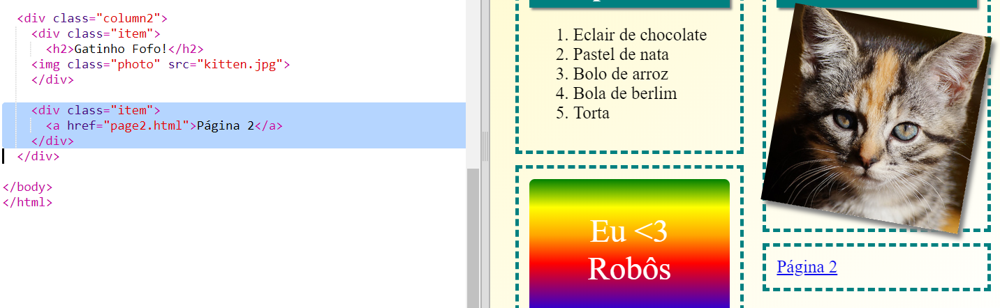

## Adicionar uma segunda página

Vamos adicionar outra página ao site da revista.

+ Adiciona uma nova página ao teu projeto e nomeie-a `page2.html`:

+ A página 2 será bastante semelhante à primeira página da tua revista, por isso podes copiar o html de `index.html` e cola-o em `page2.html`.

Nota que ambas as páginas usam o mesmo `style.css` e por isso vão partilhar estilos.

+ Altera o título `<h1>` da página 2:

+ Agora vais necessitar de links entre as tuas páginas para ir à página 2 e voltar à página inicial.

Volta para `index.html`. Adiciona um link dentro de uma div na coluna 2 em `index.html`:

+ Testa para ver se ao clicar no teu novo link vais para a página 2 da tua revista.