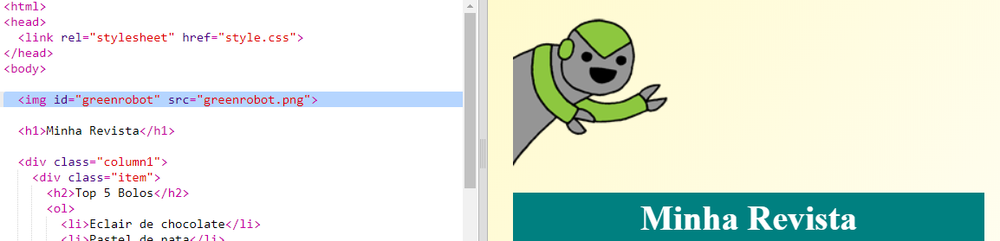
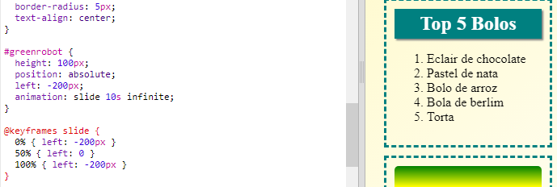

## Adicionar uma animação

Vamos adicionar uma animação divertida à tua revista.

+ Vai ao ` index.html ` e inclui a imagem ` greenrobot.png ` na parte superior da tua página.

+ Agora adiciona o CSS para animar o teu robot:

