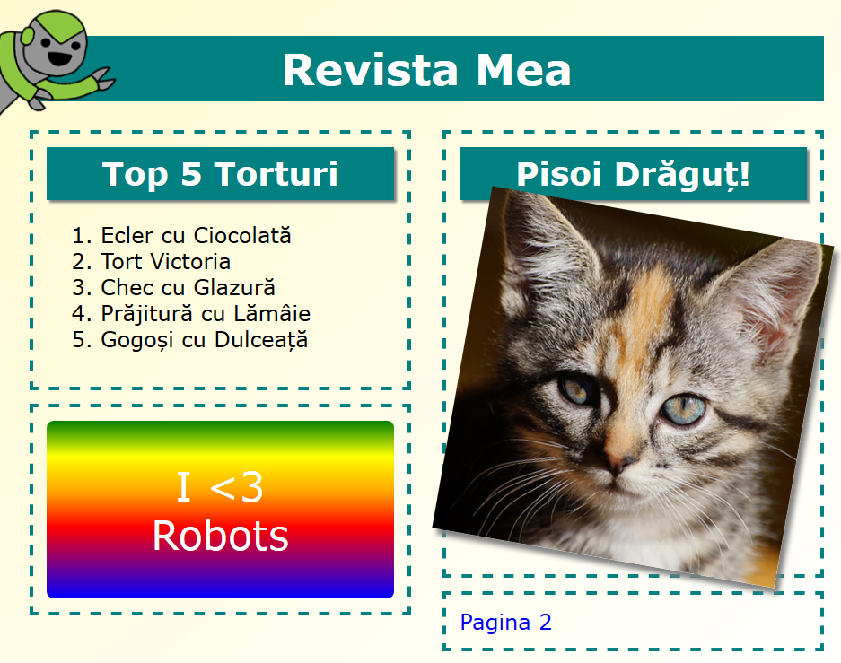

## Introducere

În acest proiect, vei învăța cum să folosești HTML și CSS pentru a crea un website pentru o revistă cu două pagini. De asemenea, o să revizitezi o mulțime de tehnici HTML și CSS din alte proiecte.

  <iframe src="https://trinket.io/embed/html/a41e4e1c5c?outputOnly=true&start=result" width="600" height="505" frameborder="0" marginwidth="0" marginheight="0" allowfullscreen>
  </iframe>
  

### Informații suplimentare pentru liderii cluburilor

Dacă vrei să printezi acest proiect, folosește [Versiunea printabilă](https://projects.raspberrypi.org/en/projects/magazine/print).

## \--- collapse \---

## title: Note pentru liderul clubului

## Introduction

În acest proiect, copiii vor învăța cum să creeze o structură cu două coloane. De asemenea, ei vor recapitula o mulțime de HTML & CSS pe care le-au învățat în alte proiecte.

## Resurse online

Recomandăm folosirea [trinket](https://trinket.io/) pentru a scrie HTML & CSS online. Proiectul conține următoarele trinket-uri:

* [Punctul de pornire pentru „Revistă” -- jumpto.cc/web-magazine](http://jumpto.cc/web-magazine)

Copiii pot, de asemenea, utiliza acest trinket gol [(jumpto.cc/html-blank)](http://jumpto.cc/html-blank) pentru a scrie propriul lor cod HTML & CSS, sau pot folosi acest șablon trinket [(jumpto.cc/html-template)](http://jumpto.cc/html-template).

De asemenea, există un trinket care conține soluția finală a provocărilor:

* [„Revistă” completat -- trinket.io/html/a41e4e1c5c](https://trinket.io/html/a41e4e1c5c)

## Resurse offline

Acest proiect poate fi [completat offline](https://www.codeclubprojects.org/en-GB/resources/webdev-working-offline/) dacă dorești. Poți accesa resursele proiectului dând click pe link-ul „Materialele proiectului” pentru acest proiect. Acest link conține o secțiune „Resursele proiectului” care include resurse de care copiii vor avea nevoie pentru a completa acest proiect offline. Asigură-te că fiecare copil are acces la o copie a acestor resurse. Această secțiune include următoarele fișiere:

* intro/index.html
* template/template.html
* template/style.css
* magazine/index.html
* magazine/style.css
* magazine/script.js
* magazine/mai multe imagini .png

De asemenea, poți găsi o versiune completă a provocărilor din acest proiect în secțiunea „Resursele voluntarilor”, care conține:

* magazine-finished/index.html
* magazine-finished/style.css
* magazine-finished/script.js
* magazine-finished/kitten.jpg
* magazine-finished/recipe-finished.jpg
* magazine-finished/greenrobot.png
* magazine-finished/spacerobot.png

(Toate resursele de mai sus pot fi descărcate și ca fișiere `.zip`.)

## Obiective de învățare

* Acest proiect învață copiii cum să creeze o revistă cu două coloane folosind `float:`. De asemenea, recapitulează HTML & CSS prezentat în detaliu în alte proiecte. Sunt prezentate exemple, astfel încât copiii vor putea să finalizeze acest proiect chiar dacă nu au finalizat unele dintre proiectele anterioare. 

Acest proiect acoperă elemente din următoarele domenii ale [Raspberry Pi Digital Making Curriculum](http://rpf.io/curriculum):

* [Proiectarea elementelor grafice 2D și 3D de bază](https://www.raspberrypi.org/curriculum/design/creator).

## Provocări

* „Adaugă elemente în coloana stângă” - plasarea elementelor în interiorul unui element plutitor;
* „Adaugă un link înapoi către prima pagină” - crearea link-urilor între paginile unui proiect;
* „Umple a doua pagină” - recapitulare HTML & CSS;
* „Adaugă altă animație” - recapitulare animații.

\--- /collapse \---

## \--- collapse \---

## title: Materiale pentru proiect

## Resursele proiectului

* [fișier .zip care conține toate resursele proiectului](resources/magazine-project-resources.zip)
* [Trinket online care conține toate resursele proiectului „Revistă”](http://jumpto.cc/web-magazine)
* [Șablon Trinket online](http://jumpto.cc/trinket-template)
* [Trinket online gol](http://jumpto.cc/trinket-blank)
* [template/index.html](resources/template-index.html)
* [template/style.css](resources/template-style.css)
* [intro/index.html](resources/intro-index.html)
* [intro/style.css](resources/intro-style.css)
* [magazine/index.html](resources/magazine-index.html)
* [magazine/style.css](resources/magazine-style.css)
* [magazine/script.js](resources/magazine-script.js)
* [magazine/kitten.jpg](resources/magazine-kitten.jpg)
* [magazine/recipe-final.png](resources/magazine-recipe-final.png)
* [magazine/greenrobot.png](resources/magazine-greenrobot.png)
* [magazine/firerobot.png](resources/magazine-firerobot.png)
* [magazine/spacerobot.png](resources/magazine-spacerobot.png)
* [magazine/dogrobot.png](resources/magazine-dogrobot.png)

## Resursele liderului de club

* [fișier .zip care conține toate resursele proiectului, completate](resources/magazine-volunteer-resources.zip)
* [Proiect Trinket online, completat](https://trinket.io/html/a41e4e1c5c)
* [magazine-finished/index.html](resources/magazine-finished-index.html)
* [magazine-finished/style.css](resources/magazine-finished-style.css)
* [magazine-finished/script.js](resources/magazine-finished-script.js)
* [magazine-finished/kitten.jpg](resources/magazine-finished-kitten.jpg)
* [magazine-finished/recipe-final.png](resources/magazine-finished-recipe-final.png)
* [magazine-finished/greenrobot.png](resources/magazine-finished-greenrobot.png)
* [magazine-finished/spacerobot.png](resources/magazine-finished-spacerobot.png)

\--- /collapse \---