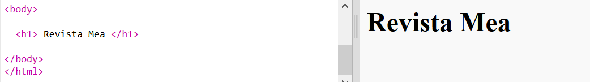
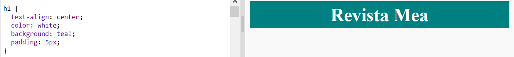
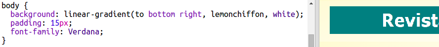

## Titlu și fundal

Website-urile de tip revistă au, de cele mai multe ori, multe elemente mici pe prima pagină. Mai întâi, vei crea un titlu și fundal pentru revista ta.

+ Deschide acest trinket: <a href="http://jumpto.cc/web-magazine" target="_blank">jumpto.cc/web-magazine</a>.
    
    Proiectul ar trebui să arate astfel:
    
    

+ Haide să adăugăm un titlu.
    
    Te poți gândi la un titlu mai bun pentru revista ta.
    
    

+ Poți să înfrumusețezi titlul?
    
    Iată un exemplu, dar tu poți să îți alegi propriul stil:
    
    

+ Acum, haide să creăm un fundal interesant folosind un gradient și să alegem un font pentru revistă.
    
    Iată câteva exemple pentru a îți reaminti cum să creezi un gradient:
    
    