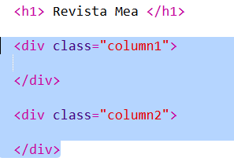
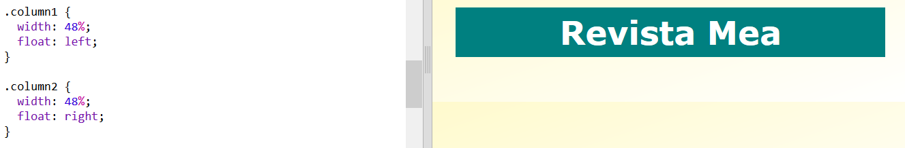
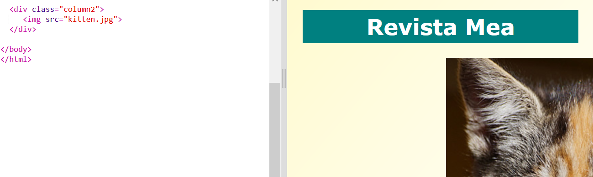
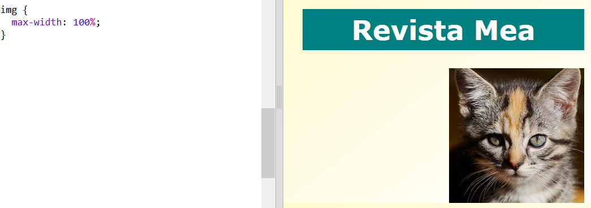

## Crearea coloanelor

Website-urile adesea folosesc mai multe coloane. Haide să creăm o structură cu două coloane pentru revista ta.

+ Mai întâi crează două elemente `div` pentru coloane.
    
    Adaugă codul HTML evidențiat la `index.html`:
    
    

+ Acum, adaugă stiluri elementelor div pentru coloane astfel încât unul să plutească la stânga, iar celălalt la dreapta.
    
    
    
    Fiecare coloană este mai mică de 50%, astfel că există loc pentru spațiere.
    
    Va trebui să adaugi ceva într-o coloană pentru a vedea efectul.

+ Haide să adăugăm o fotografie a unei pisici în partea de sus a coloanei 2.
    
    
    
    Observă că imaginea pisicii este poziționată la jumătatea paginii, în a doua coloană.
    
    Este un pic cam mare!

+ Haide să folosim `max-width:` pentru a face imaginile să se potrivească în container-ul lor.
    
    Adaugă următorul stil la `style.css`.
    
    
    
    Acesta se va aplica tuturor imaginilor pe care le vei utiliza în revista ta, nu doar pisicii.

+ Acum adaugă o clasă imaginii `photo`, astfel încât să o poți modela:
    
    

+ Și modifică imaginea pentru a adăuga o umbră și o rotație pentru a face fotografia să iasă afară din pagină:
    
    
    
    Fă câteva modificări până când îți place rezultatul.