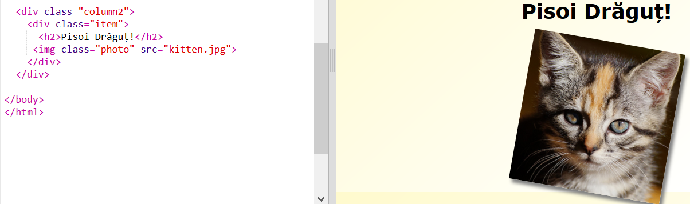
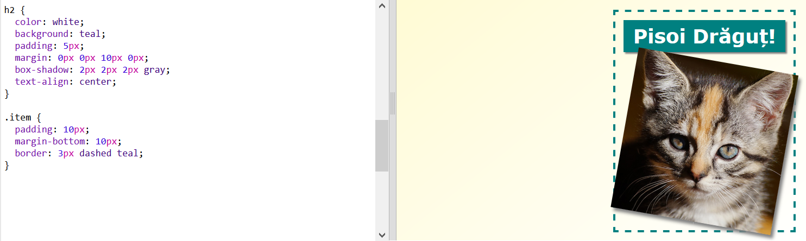

## Stilizează elementele revistei

Haide să facem aspectul puțin mai interesant.

+ Adaugă un `div` în jurul imaginii cu `class` și adaugă un titlu `h2`:
    
    

+ Acum, stilizează elementul și titlul.
    
    Iată un exemplu, dar poți face modificări:
    
    