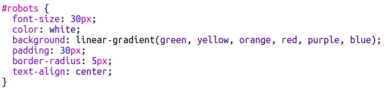

--- challenge ---

## Provocare: adaugă elemente în coloana stângă

Poți adăuga o listă ordonată și un sticker de text gradient în coloana din stânga?

Iată un exemplu:

Acesta este codul pentru exemplu, dar îl poți modifica sau poți crea propriul tau cod.

HTML:

CSS:

--- /challenge ---