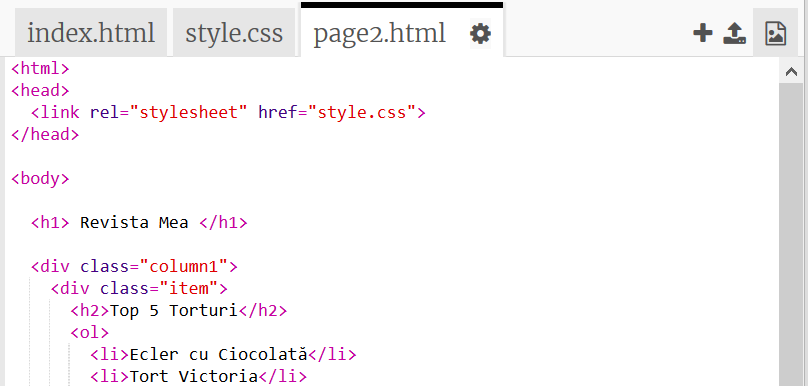
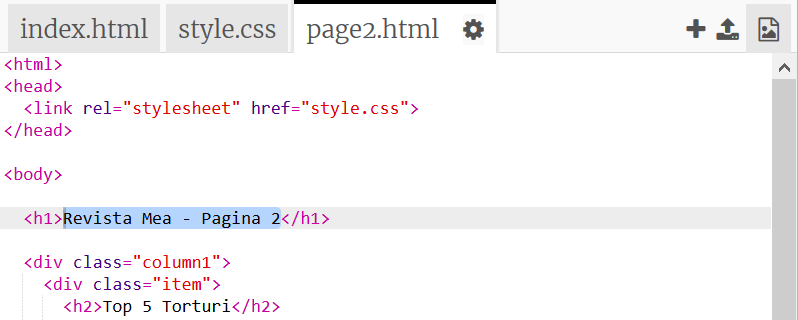
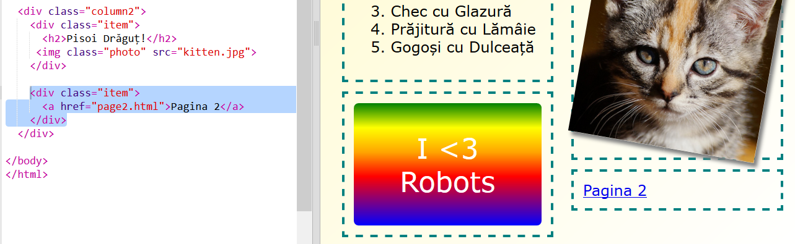

## Adaugă o a doua pagină

Haide să adăugăm o altă pagină website-ului revistei.

+ Adaugă o nouă pagină la proiect și denumește-o `page2.html`:

+ Pagina 2 va fi destul de similară cu prima pagină a revistei, așa că poți copia codul html de la `index.html` și să îl inserezi în `page2.html`.

Observă că ambele pagini folosesc același `style.css` și vor împărtăși stiluri.

+ Schimbă titlul `<h1>` pentru page2:

+ Acum, vei avea nevoie de link-uri între paginile tale pentru a putea ajunge la pagina 2 și înapoi la prima pagină.

Revino la `index.html`. Adaugă un link în interiorul unui div în coloana 2 în `index.html`:

+ Testează că poți da click pe noul tău link și să te deplasezi la pagina 2 a revistei tale.