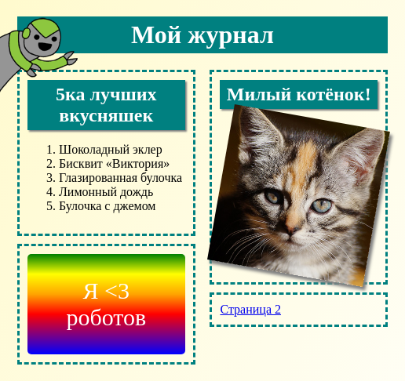

## Введение

В этом проекте ты научишься использовать HTML и CSS для создания веб-сайта многостраничного журнала с двумя страницами. Ты также освежишь свои знания о приёмах HTML и CSS, изученные тобой в других проектах.

  <iframe src="https://trinket.io/embed/html/a41e4e1c5c?outputOnly=true&start=result" width="600" height="505" frameborder="0" marginwidth="0" marginheight="0" allowfullscreen>
  </iframe>
  

### Дополнительная информация для руководителей клуба

Если вам нужно распечатать этот проект, пожалуйста, используйте [Версию для печати](https://projects.raspberrypi.org/en/projects/magazine/print).

## \--- collapse \---

## title: Заметки для руководителя клуба

## Введение

В этом проекте дети научатся верстать двухколонную разметку. Они также повторят приёмы HTML и CSS, изученные в других проектах.

## Интернет-ресурсы

Мы рекомендуем использовать [trinket](https://trinket.io/) для написания HTML и CSS онлайн. Этот проект содержит следующие trinket-ы:

* [Стартовый проект 'Журнал (Magazine)' -- jumpto.cc/web-magazine](http://jumpto.cc/web-magazine)

Дети также могут использовать этот пустой trinket[(jumpto.cc/html-blank)](http://jumpto.cc/html-blank), чтобы написать свой собственный HTML & CSS или, в качестве альтернативы, они могут использовать этот шаблон [(jumpto.cc/html-template)](http://jumpto.cc/html-template).

Имеется также trinket, содержащий пример решения для задач:

* [Готовый 'Журнал (Magazine)' -- trinket.io/html/a41e4e1c5c](https://trinket.io/html/a41e4e1c5c)

## Оффлайн Ресурсы

This project can be [completed offline](https://rpf.io/html-offline) if preferred. Вы можете получить доступ к ресурсам этого проекта, щёлкнув в нём ссылку 'Материалы проекта'. Эта ссылка содержит раздел «Ресурсы проекта», включающий ресурсы, которые понадобятся детям, чтобы завершить этот проект в режиме оффлайн (автономном режиме). Убедитесь, что у каждого ребёнка есть доступ к копии этих ресурсов. Этот раздел содержит следующие файлы:

* intro/index.html
* template/template.html
* template/style.css
* magazine/index.html
* magazine/style.css
* magazine/script.js
* изображения magazine/mutliple .png

Вы также можете найти завершенную версию этого проекта в разделе «Ресурсы волонтёров», который содержит:

* magazine-finished/index.html
* magazine-finished/style.css
* magazine-finished/script.js
* magazine-finished/kitten.jpg
* magazine-finished/recipe-finished.jpg
* magazine-finished/greenrobot.png
* magazine-finished/spacerobot.png

(Все вышеперечисленные ресурсы также можно загрузить как файлы project и volunteer `.zip`.)

## Цели обучения

* В этом проекте детям показывается, как создать двухколонную разметку с помощью `float:`. В проекте также используются приёмы HTML и CSS, изучаемые более детально в других проектах. Предоставляются примеры решений, что позволит детям завершить этот проект, даже если они не изучили предыдущие проекты. 

This project covers elements from the following strands of the [Raspberry Pi Digital Making Curriculum](https://rpf.io/curriculum):

* [Спроектируйте 2D и 3D ресурсы](https://www.raspberrypi.org/curriculum/design/creator).

## Задачи

* «Наполни левую колонку содержимым» — добавление элементов в плавающий (floating) элемент;
* «Добавь ссылку на первую страницу» — создание ссылок между страницами проекта;
* «Наполни содержимым вторую страницу» — повторение приёмов HTML и CSS;
* «Добавь ещё одну анимацию» — повторение создания анимаций.

\--- /collapse \---

## \--- collapse \---

## title: Материалы проекта

## Ресурсы проекта

* [.zip-файл, содержащий все ресурсы проекта](https://rpf.io/p/en/magazine-go)
* [Trinket, содержащий все ресурсы проекта «Журнал» (онлайн)](http://jumpto.cc/web-magazine)
* [Шаблон trinket-а (онлайн)](http://jumpto.cc/trinket-template)
* [Пустой trinket (онлайн)](http://jumpto.cc/trinket-blank)
* [template/index.html](resources/template-index.html)
* [template/style.css](resources/template-style.css)
* [intro/index.html](resources/intro-index.html)
* [intro/style.css](resources/intro-style.css)
* [magazine/index.html](resources/magazine-index.html)
* [magazine/style.css](resources/magazine-style.css)
* [magazine/script.js](resources/magazine-script.js)
* [magazine/kitten.jpg](resources/magazine-kitten.jpg)
* [magazine/recipe-final.png](resources/magazine-recipe-final.png)
* [magazine/greenrobot.png](resources/magazine-greenrobot.png)
* [magazine/firerobot.png](resources/magazine-firerobot.png)
* [magazine/spacerobot.png](resources/magazine-spacerobot.png)
* [magazine/dogrobot.png](resources/magazine-dogrobot.png)

## Ресурсы для руководителя клуба

* [.zip-файл, содержащий все ресурсы завершённого проекта](https://rpf.io/p/en/magazine-go)
* [Завершённый проект в trinket (онлайн)](https://trinket.io/html/a41e4e1c5c)
* [magazine-finished/index.html](resources/magazine-finished-index.html)
* [magazine-finished/style.css](resources/magazine-finished-style.css)
* [magazine-finished/script.js](resources/magazine-finished-script.js)
* [magazine-finished/kitten.jpg](resources/magazine-finished-kitten.jpg)
* [magazine-finished/recipe-final.png](resources/magazine-finished-recipe-final.png)
* [magazine-finished/greenrobot.png](resources/magazine-finished-greenrobot.png)
* [magazine-finished/spacerobot.png](resources/magazine-finished-spacerobot.png)

\--- /collapse \---