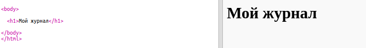
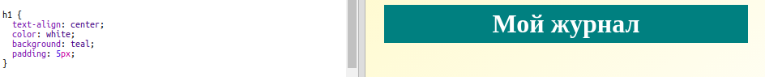
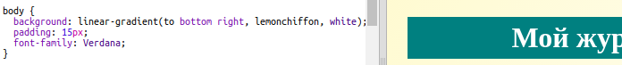

## Заголовок и фон

Веб-сайты в стиле журнала строятся из множества небольших компонент на странице. Сперва тебе предлагается создать заголовок и фон для твоего журнала.

+ Открой этот trinket: <a href="http://jumpto.cc/web-magazine" target="_blank">jumpto.cc/web-magazine</a>.
    
    Проект должен выглядеть следующим образом:
    
    

+ Давай добавим заголовок.
    
    Ты можешь придумать другой заголовок для своего журнала.
    
    

+ Можешь ли ты добавить стиль к заголовку?
    
    Вот пример, но ты можешь создать свой собственный стиль:
    
    

+ Теперь давай зададим привлекательный фон, используя градиент, а также выберем шрифт для журнала.
    
    Вот, к примеру, стиль, задающий градиент:
    
    