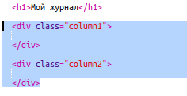
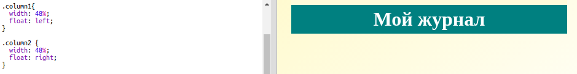
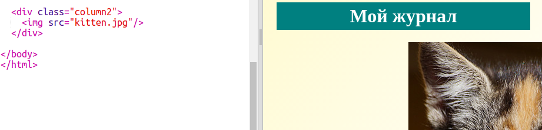
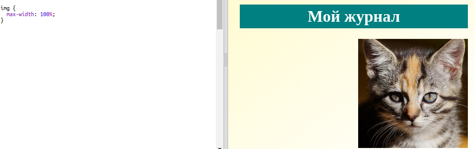

## Создание колонок

Веб-сайты часто используют множество колонок. Давай создадим разметку из двух колонок для твоего журнала.

+ Для начала создай по блоку `div` для каждой из твоих колонок.
    
    Добавь выделенный HTML-код в `index.html`:
    
    

+ Теперь задай этим блокам div стиль так, чтобы одна колонка стремилась влево, в другая — вправо.
    
    
    
    Каждая колонка по ширине меньше 50%, так что у нас есть ещё место для добавления внутренних отступов (padding) для текста внутри div-ов.
    
    Тебе нужно добавить что-нибудь в колонки, чтобы увидеть отступы внутри div-ов.

+ Давай добавим изображение котёнка в верхушку второй колонки.
    
    
    
    Обрати внимание, что изображение котёнка расположилось во второй половине страницы, во второй колонке.
    
    Правда, оно немного большевато!

+ Давай добавим `max-width:`, чтобы изображения не превышали размер контейнера (т.е. div-а колонки).
    
    Добавь следующий стиль в `style.css`.
    
    
    
    Стиль будет применён ко всем изображениям в твоём журнале, не только к изображению котёнка.

+ Теперь добавь класс `photo` к изображению котёнка, чтобы его можно было стилизовать:
    
    

+ Также задай правила стиля для изображения, добавляющие тень и поворот, чтобы фотография как бы вываливалась из страницы:
    
    
    
    Поэкспериментируй со стилями, пока не получишь результат, который тебе нравится.