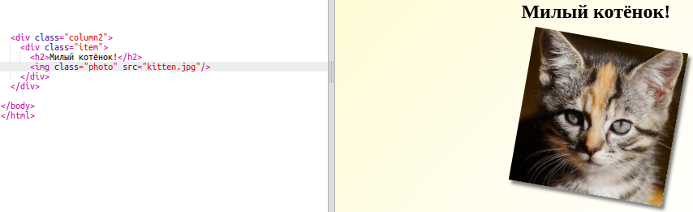
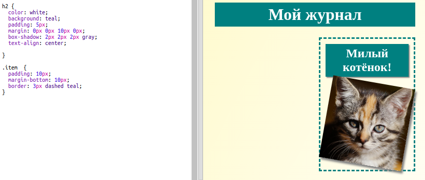

## Стилизация компонент журнала

Давай сделаем разметку немного более интересной.

+ Оберни в `div` твоё изображение с `class` и добавь заголовок через `h2`:
    
    

+ Теперь стилизуй компоненты и заголовок.
    
    Вот тебе пример, но ты можешь добавить что-нибудь своё:
    
    