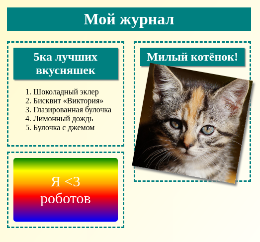
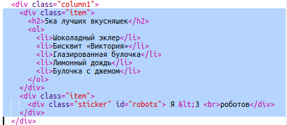

\--- challenge \---

## Задача: Добавь компоненты в левую колонку

Можешь ли ты добавить в левую колонку упорядоченный список и наклейку с текстом на фоне градиента?

Вот тебе пример:

Этот код для примера, ты можешь изменить его или придумать что-то своё.

HTML:

CSS:

\--- /challenge \---