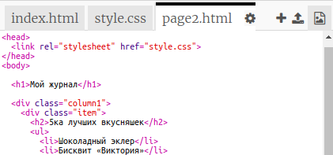
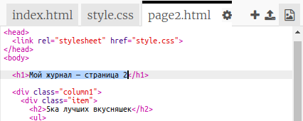
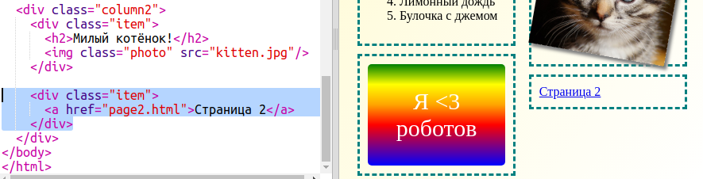

## Добавь вторую страницу

Давай добавим ещё одну страницу в твой журнал.

+ Добавь новую страницу (новый файл) в твой проект и назови её `page2.html`:

+ Страница 2 будет несколько похожа на первую страницу твоего журнала, так что ты можешь скопировать html-код из `index.html` и вставить его в `page2.html`.

Заметь, что обе страницы используют тот же `style.css`, так что они будут иметь общий стиль.

+ Измени заголовок `<h1>` в page2.html:

+ Теперь тебе понадобятся ссылки между страницами, чтобы можно было переходить на страницу 2 и обратно на фронтовую страницу.

Вернись к `index.html`. Внутри div-а во 2ую колонку `index.html` добавь ссылку:

+ Убедись, что ты можешь кликать по твоей новой ссылке и перемещаться на 2ую страницу журнала.