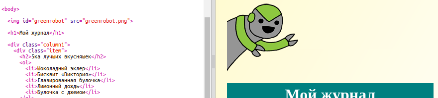
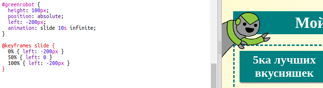

## Добавь анимацию

Давай добавим весёлую анимацию в твой журнал.

+ Открой `index.html` и вставь изображение `greenrobot.png` в верхушку твоей страницы.

+ Теперь добавь CSS, чтобы анимировать твоего робота:

