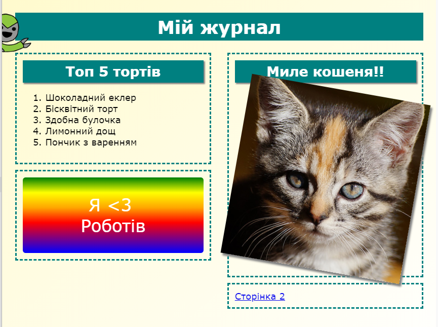

## Вступ

У цьому проєкті ти дізнаєшся як використовувати HTML та CSS для створення багатосторінкового вебсайту журналу. Також, ти повториш багато прийомів HTML та CSS з інших проєктів.

  <iframe src="https://trinket.io/embed/html/a41e4e1c5c?outputOnly=true&start=result" width="600" height="505" frameborder="0" marginwidth="0" marginheight="0" allowfullscreen>
  </iframe>
  

### Додаткова інформація для лідерів клубу

Якщо вам потрібно роздрукувати цей проєкт, будь ласка, скористайтеся [версією для друку](https://projects.raspberrypi.org/en/projects/magazine/print).

## \---collapse\---

## title: Нотатки керівника клубу

## Вступ

У цьому проєкті діти навчаться створювати двоколонковий макет. Вони також повторять матеріал по HTML та CSS, який вони вивчали в інших проєктах.

## Онлайн Ресурси

Ми рекомендуємо використовувати [trinket](https://trinket.io/) щоб писати код HTML та CSS онлайн. Цей проєкт містить такі ресурси trinket:

* [Шаблон "Журнал" -- jumpto.cc/web-magazine](http://jumpto.cc/web-magazine)

Діти також можуть скористатися порожнім проєктом [(jumpto.cc/html-blank)](http://jumpto.cc/html-blank) щоб писати свій власний код HTML та CSS, або вони можуть використовувати шаблон [(jumpto.cc/html-template)](http://jumpto.cc/html-template).

Також, існує проєкт, що містить приклади вирішення завдань:

* [Завершений проєкт "Журнал" -- trinket.io/html/a41e4e1c5c](https://trinket.io/html/a41e4e1c5c)

## Офлайн Ресурси

This project can be [completed offline](https://rpf.io/html-offline) if preferred. Ви можете отримати доступ до ресурсів проєкту, натиснувши на посилання "Матеріали проєкту". Це посилання містить розділ "Ресурси проєкту", який включає в себе ресурси, необхідні дітям для реалізації цього проєкту в режимі офлайн. Переконайтеся, що кожна дитина має доступ до копії цих ресурсів. Цей розділ містить наступні файли:

* intro/index.html
* template/template.html
* template/style.css
* magazine/index.html
* magazine/style.css
* magazine/script.js
* magazine/кілька зображень .png

Також, ви можете знайти завершену версію цього проєкту в розділі "Ресурси керівника клубу", яка містить:

* magazine-finished/index.html
* magazine-finished/style.css
* magazine-finished/script.js
* magazine-finished/kitten.jpg
* magazine-finished/recipe-finished.jpg
* magazine-finished/greenrobot.png
* magazine-finished/spacerobot.png

(Всі вищезгадані ресурси доступні для завантаження як `.zip`-файли проєкта та керівника клубу.)

## Цілі навчання

* Цей проєкт навчить дітей створювати двоколонковий макет журналу за допомогою `float:`. Він також включає багато матеріалу по HTML та CSS з попередніх проєктів. Наведено приклади, щоб діти змогли завершити цей проєкт, навіть якщо вони не виконували якісь із попередніх проєктів. 

This project covers elements from the following strands of the [Raspberry Pi Digital Making Curriculum](https://rpf.io/curriculum):

* [Розробка простих ресурсів 2D та 3D](https://www.raspberrypi.org/curriculum/design/creator).

## Завдання

* "Додай об'єкти в ліву колонку" — розміщення фрагментів всередині плаваючого елемента;
* "Додай посилання на першу сторінку" — створення зв’язків між сторінками в проєкті;
* "Заповни другу сторінку" — повторення HTML та CSS;
* "Додаткова анімація" — повторення анімацій.

\---collapse\---

## \---collapse\---

## title: Матеріали проєкту

## Ресурси проєкту

* [.zip-файл, що містить всі ресурси проєкту](https://rpf.io/p/en/magazine-go)
* [Онлайн проєкт Trinket, що містить всі ресурси проєкту "Журнал"](http://jumpto.cc/web-magazine)
* [Онлайн шаблон проєкту Trinket](http://jumpto.cc/trinket-template)
* [Порожній онлайн проєкт Trinket](http://jumpto.cc/trinket-blank)
* [template/index.html](resources/template-index.html)
* [template/style.css](resources/template-style.css)
* [intro/index.html](resources/intro-index.html)
* [intro/style.css](resources/intro-style.css)
* [magazine/index.html](resources/magazine-index.html)
* [magazine/style.css](resources/magazine-style.css)
* [magazine/script.js](resources/magazine-script.js)
* [magazine/kitten.jpg](resources/magazine-kitten.jpg)
* [magazine/recipe-final.png](resources/magazine-recipe-final.png)
* [magazine/greenrobot.png](resources/magazine-greenrobot.png)
* [magazine/firerobot.png](resources/magazine-firerobot.png)
* [magazine/spacerobot.png](resources/magazine-spacerobot.png)
* [magazine/dogrobot.png](resources/magazine-dogrobot.png)

## Ресурси керівника клубу

* [.zip-файл, що містить всі завершені проєктні ресурси](https://rpf.io/p/en/magazine-go)
* [Завершений онлайн проєкт Trinket](https://trinket.io/html/a41e4e1c5c)
* [magazine-finished/index.html](resources/magazine-finished-index.html)
* [magazine-finished/style.css](resources/magazine-finished-style.css)
* [magazine-finished/script.js](resources/magazine-finished-script.js)
* [magazine-finished/kitten.jpg](resources/magazine-finished-kitten.jpg)
* [magazine-finished/recipe-final.png](resources/magazine-finished-recipe-final.png)
* [magazine-finished/greenrobot.png](resources/magazine-finished-greenrobot.png)
* [magazine-finished/spacerobot.png](resources/magazine-finished-spacerobot.png)

\---collapse\---