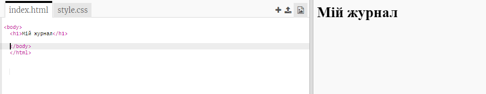
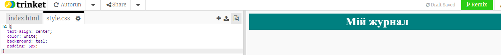
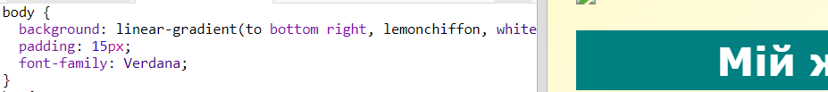

## Заголовок та фон

Веб-сайти журналу часто мають багато маленьких деталей на сторінці. Спочатку вам потрібно створити заголовок та фон для вашого журналу.

+ Відкрийте це посилання: <a href="http://jumpto.cc/web-magazine" target="_blank">jumpto.cc/web-magazine</a>.
    
    Проект повинен виглядати так:
    
    

+ Додайте заголовок.
    
    Ви можете подумати про кращий title для вашого журналу.
    
    

+ Чи можете ви стилізувати ваш заголовок?
    
    Ось приклад, але ви можете вибрати вашу власний стиль:
    
    

+ Зараз давайте придумаємо цікавий фон використовуючи градієнт та виберіть шрифт для журналу.
    
    Ось приклад назви, як нагадування про те, як створювати градієнт:
    
    