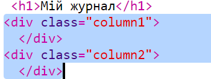
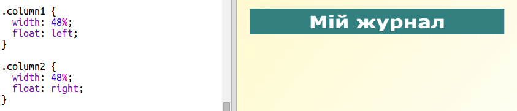
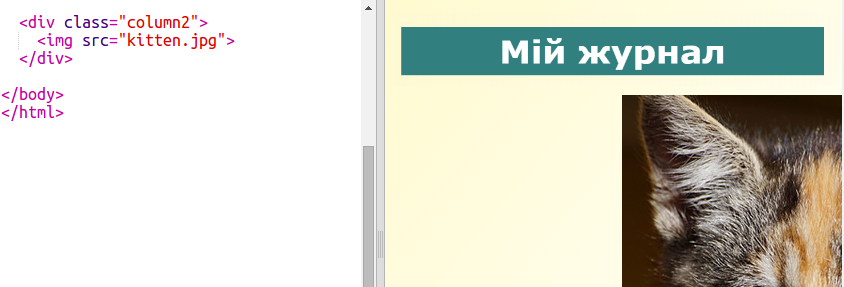
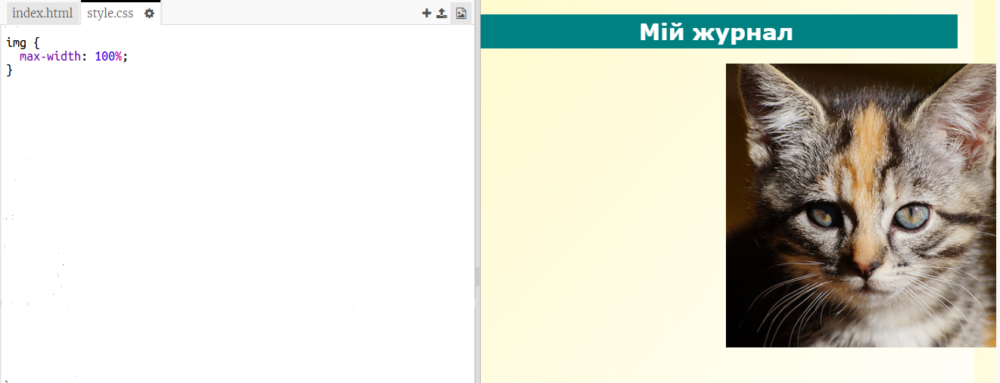

## Створення колонок

Вебсайти часто використовують декілька колонок. Давай створимо макет із двома колонками для твого журналу.

+ Спочатку створи два елементи `div` для кожної колонки.
    
    Додай виділений код HTML до `index.html`:
    
    

+ А тепер створи стилі для цих елементів div так, щоб один був зліва, а інший — справа.
    
    
    
    Кожна колонка менша ніж 50%, тому ще є місце для відступу.
    
    Ти маєш додати щось в колонку, щоб побачити результат.

+ Давай додамо зображення кошеняти зверху другої колонки.
    
    
    
    Зверни увагу, що зображення кошеняти розташоване приблизно в другій половині сторінки, у другій колонці.
    
    Проте воно трохи завелике!

+ Давай використаємо `max-width:` для того, щоб зображення помістилося в колонку.
    
    Додай наступний стиль до `style.css`.
    
    
    
    Він буде відноситися до всіх зображень твого журналу, а не тільки до кошеняти.

+ Тепер додай клас `photo` до зображення так, щоб його можна було стилізувати:
    
    

+ І створи стиль для картинки, щоб додати тінь та поворот так, щоб зображення виділялося на сторінці:
    
    
    
    Внось зміни, поки результат тобі не сподобається.