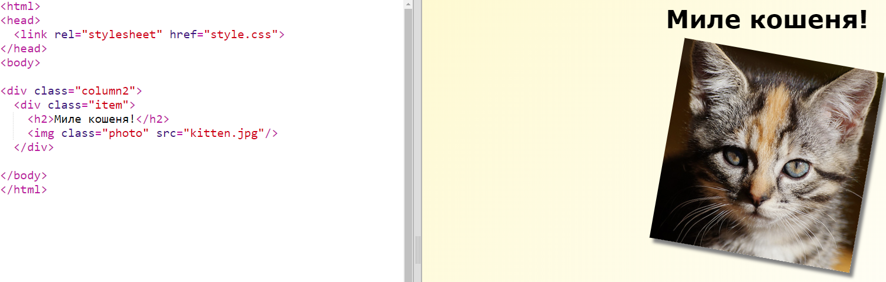
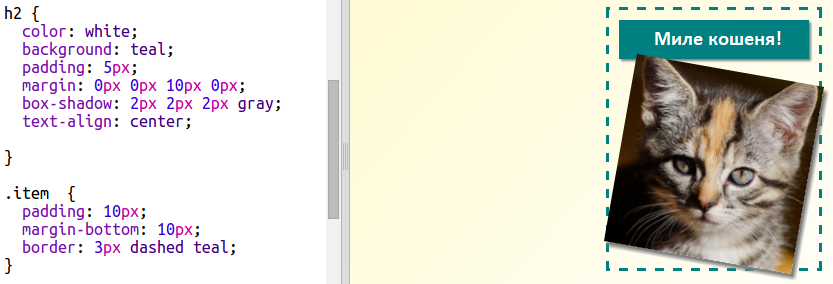

## Стилізуйте предмети журналу

Зробіть макет трішки цікавішим.

+ Додайте `div` навколо вашого зображення `class` та додайте `h2` заголовок:
    
    

+ Тепер стилізуйте об'єкт і заголовок.
    
    Ось приклад, але ви можете вносити зміни:
    
    