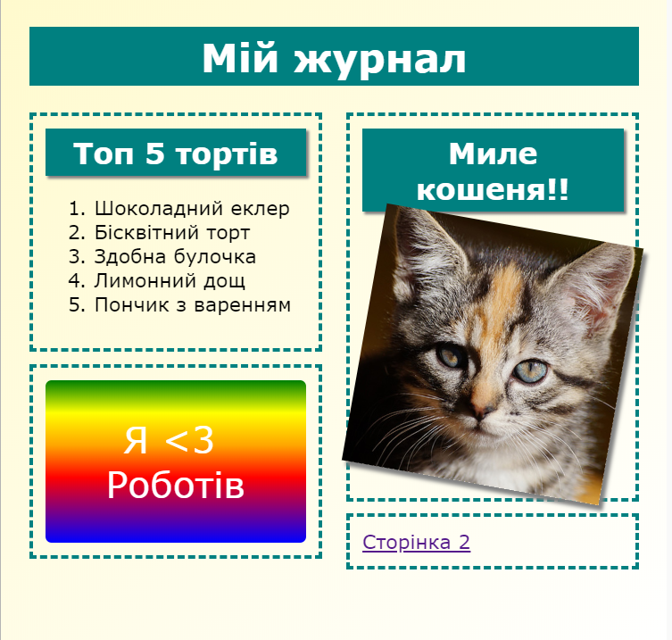
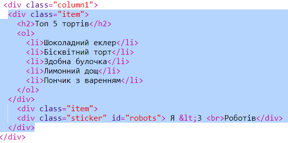

--- challenge ---

## Завдання: додайте об'єкти до лівої колонки

Чи можете ви додати упорядкований список та градієнт текстової наклейки до лівої колонки?

Наприклад:

Це код для прикладу, але ви можете змінити його або придумати власний.

HTML:

CSS:

--- /challenge ---